---
## Front matter
lang: ru-RU
title: Лабораторная работа №1
subtitle: Операционные системы
author:
  - Башиянц А. К.
institute:
  - Российский университет дружбы народов, Москва, Россия

date: 05 марта 2025

## i18n babel
babel-lang: russian
babel-otherlangs: english

## Formatting pdf
toc: false
toc-title: Содержание
slide_level: 2
aspectratio: 169
section-titles: true
theme: metropolis
header-includes:
 - \metroset{progressbar=frametitle,sectionpage=progressbar,numbering=fraction}
---

# Вводная часть

## Цели и задачи

Цель данной работы --- приобрести практические навыки установки операционной системы на виртуальную машину, настройки минимально необходимых для дальнейшей работы сервисов.

* Устанавливать виртуальную машину;

* Устанавливать необходимые пакеты;

* Получать информацию о системе.

# Выполнение лабораторной работы

## Установка Fedora

После скачивания образа Fedora установим виртуальную машину.

:::::::::::::: {.columns align=center}
::: {.column width="50%"}

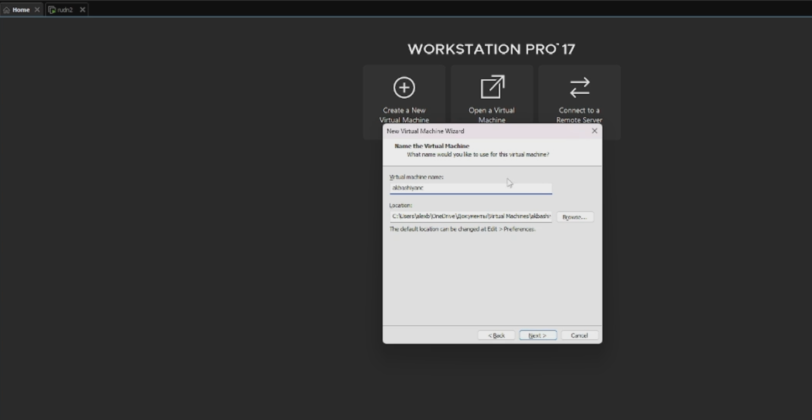{#fig:001 width=70%}

:::
::: {.column width="50%"}

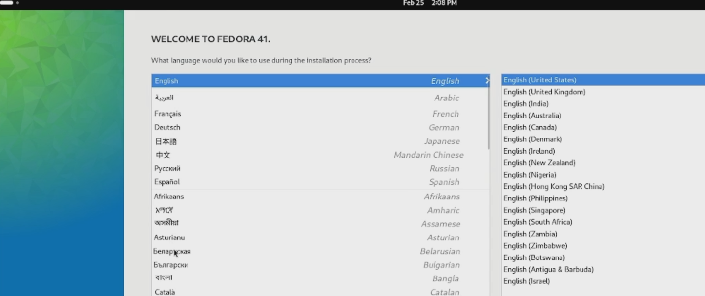{#fig:002 width=70%}

:::
::::::::::::::

## Установка средства разработки

Установим средства разработки, пакет DKMS, подмонтируем диск и установим драйвера.

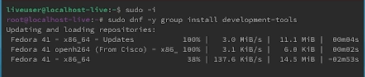{#fig:003 width=70%}

## Установка средства разработки

Установим средства разработки и программы для удобства работы в консоли.

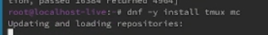{#fig:004 width=70%}

## Автоматическое обновление
Сделаем автоматическое обновление.
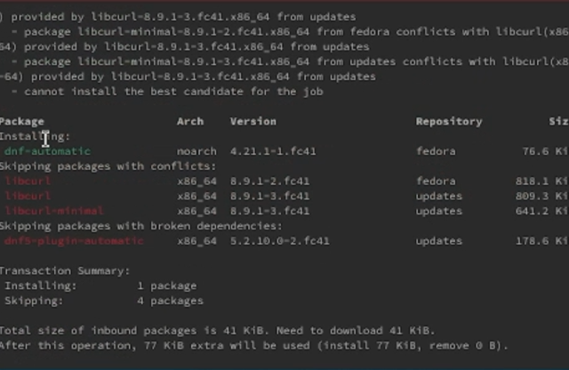{#fig:005 width=70%}

## Отключение SELinux
Отключим SELinux.

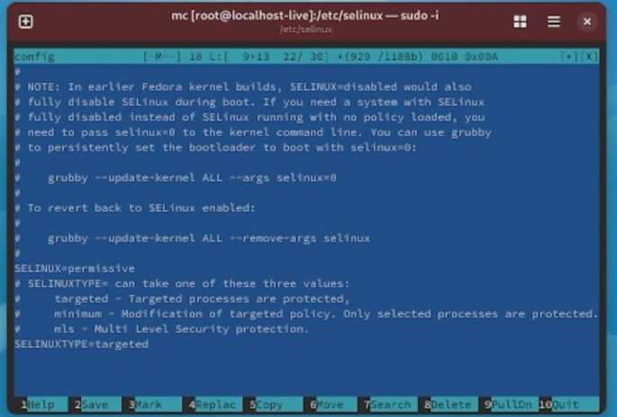{#fig:006 width=70%}

## Установка имени пользователя
Установим имя пользователя и название хоста. Проверим, что все правильно.

:::::::::::::: {.columns align=center}
::: {.column width="50%"}

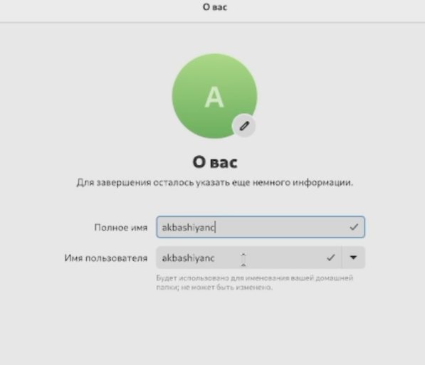{#fig:007 width=70%}

:::
::: {.column width="50%"}

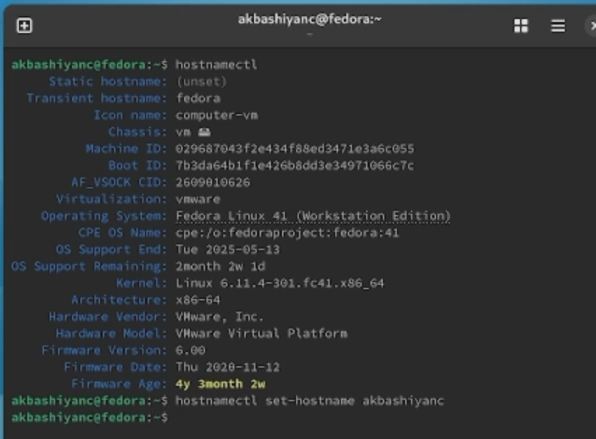{#fig:008 width=70%}

:::
::::::::::::::

## Установка Pandoc

Установим Pandoc

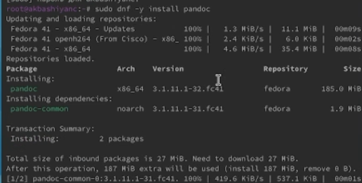{#fig:009 width=70%}

## Установка TeXlive

Установим дистрибутив TeXlive 

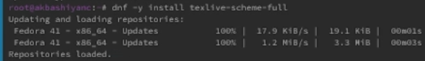{#fig:010 width=70%}

# Домашнее задание

С помощью grep выясним следующую информацию:

## Версия ядра Linux (Linux version)

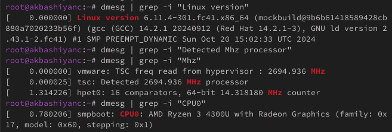{#fig:a111 width=70%}

## Частота процессора (Detected Mhz processor)

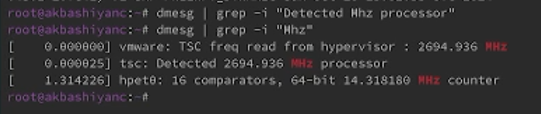{#fig:012 width=70%}

## Модель процессора (CPU0)

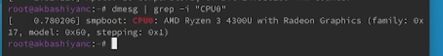{#fig:013 width=70%}

## Объём доступной оперативной памяти (Memory available)

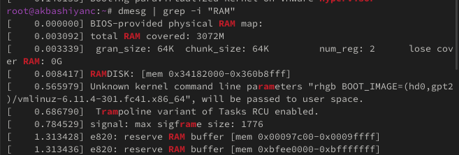{#fig:014 width=70%}

## Тип обнаруженного гипервизора (Hypervisor detected)

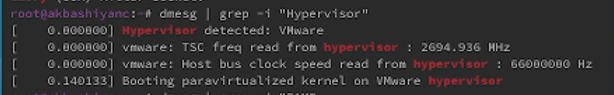{#fig:015 width=70%}

## Тип файловой системы корневого раздела

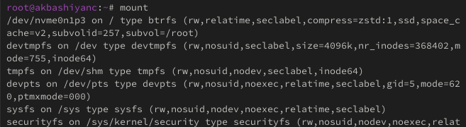{#fig:016 width=70%}

## Последовательность монтирования файловых систем

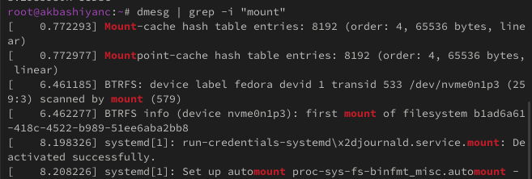{#fig:017 width=70%}

# Выводы

- В этой лабораторной работе мы изучили работу виртуальной машины и ее настройки.
