---
## Front matter
title: "Лабораторная работа №1"
subtitle: "Операционные системы"
author: "Башиянц Александра Кареновна"
## Generic otions
lang: ru-RU
toc-title: "Содержание"

## Bibliography
bibliography: bib/cite.bib
csl: pandoc/csl/gost-r-7-0-5-2008-numeric.csl

## Pdf output format
toc: true # Table of contents
toc-depth: 2
lof: true # List of figures
lot: false # List of tables
fontsize: 12pt
linestretch: 1.5
papersize: a4
documentclass: scrreprt
## I18n polyglossia
polyglossia-lang:
  name: russian
  options:
	- spelling=modern
	- babelshorthands=true
polyglossia-otherlangs:
  name: english
## I18n babel
babel-lang: russian
babel-otherlangs: english
## Fonts
mainfont: IBM Plex Serif
romanfont: IBM Plex Serif
sansfont: IBM Plex Sans
monofont: IBM Plex Mono
mathfont: STIX Two Math
mainfontoptions: Ligatures=Common,Ligatures=TeX,Scale=0.94
romanfontoptions: Ligatures=Common,Ligatures=TeX,Scale=0.94
sansfontoptions: Ligatures=Common,Ligatures=TeX,Scale=MatchLowercase,Scale=0.94
monofontoptions: Scale=MatchLowercase,Scale=0.94,FakeStretch=0.9
mathfontoptions:
## Biblatex
biblatex: true
biblio-style: "gost-numeric"
biblatexoptions:
  - parentracker=true
  - backend=biber
  - hyperref=auto
  - language=auto
  - autolang=other*
  - citestyle=gost-numeric
## Pandoc-crossref LaTeX customization
figureTitle: "Рис."
tableTitle: "Таблица"
listingTitle: "Листинг"
lofTitle: "Список иллюстраций"
lotTitle: "Список таблиц"
lolTitle: "Листинги"
## Misc options
indent: true
header-includes:
  - \usepackage{indentfirst}
  - \usepackage{float} # keep figures where there are in the text
  - \floatplacement{figure}{H} # keep figures where there are in the text
---

# Цель работы

Цель данной работы --- приобрести практические навыки установки операционной системы на виртуальную машину, настройки минимально необходимых для дальнейшей работы сервисов.

# Задание

В этой лабораторной работе необходимо изучить работу виртуальной машины и ее настройки.

Необходимо научиться:

* Устанавливать виртуальную машину;

* Устанавливать необходимые пакеты;

* Получать информацию о системе.

# Выполнение лабораторной работы

После скачивания образа Fedora установим виртуальную машину (рис. [-@fig:001]-[-@fig:002]).

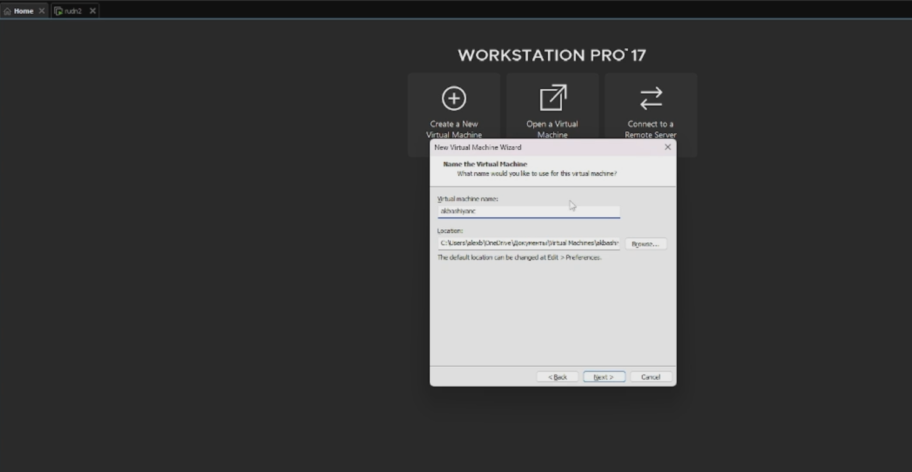{#fig:001 width=70%}

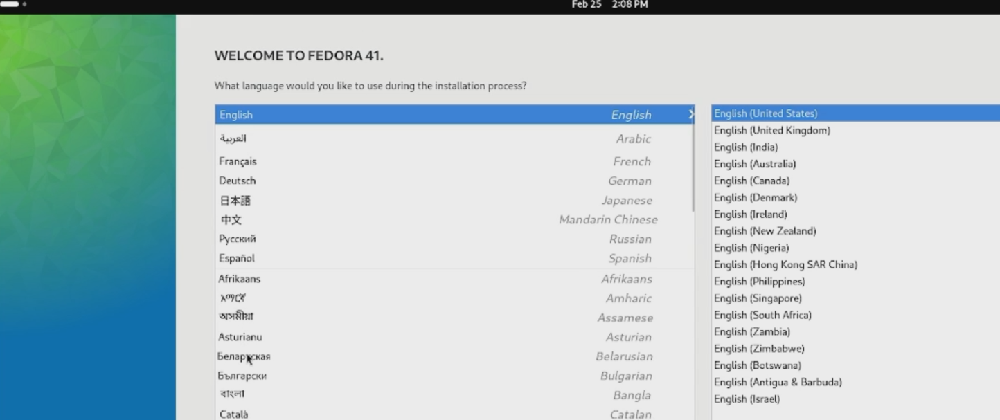{#fig:002 width=70%}

Установим средства разработки, пакет DKMS, подмонтируем диск и установим драйвера (рис. [-@fig:003]).

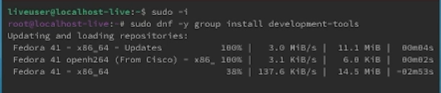{#fig:003 width=70%}

Установим средства разработки и программы для удобства работы в консоли (рис. [-@fig:004]).

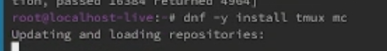{#fig:004 width=70%}

Сделаем автоматическое обновление (рис. [-@fig:004]).

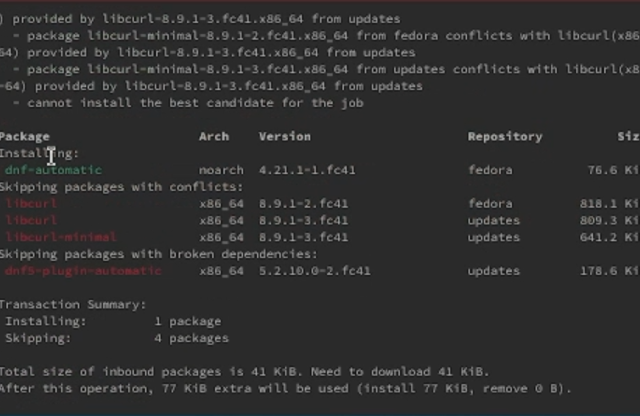{#fig:005 width=70%}

Отключим SELinux (рис. [-@fig:006]).

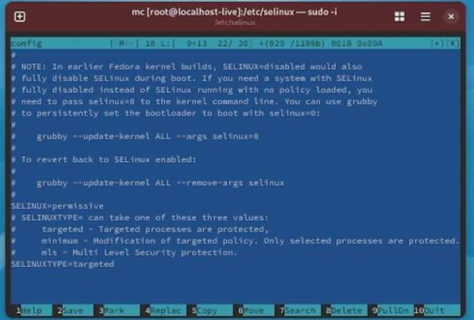{#fig:006 width=70%}

Установим имя пользователя и название хоста (рис. [-@fig:007]). Проверим, что все правильно (рис. [-@fig:008]).

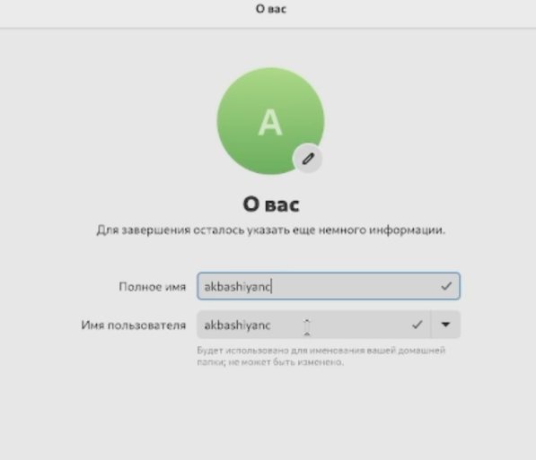{#fig:007 width=70%}

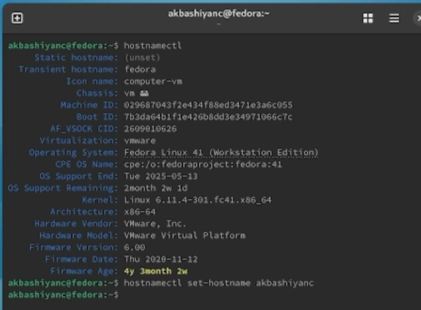{#fig:008 width=70%}

Установим Pandoc (рис. [-@fig:009]).

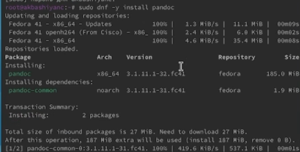{#fig:009 width=70%}

Установим дистрибутив TeXlive (рис. [-@fig:010]).

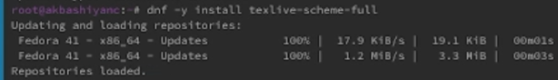{#fig:010 width=70%}

## Домашнее задание

С помощью grep выясним следующую информацию:

* Версия ядра Linux (Linux version) (рис. [-@fig:a111]);

* Частота процессора (Detected Mhz processor) (рис. [-@fig:012]);

* Модель процессора (CPU0) (рис. [-@fig:013]);

* Объём доступной оперативной памяти (Memory available) (рис. [-@fig:014]);

* Тип обнаруженного гипервизора (Hypervisor detected) (рис. [-@fig:015]);

* Тип файловой системы корневого раздела (рис. [-@fig:016]);

* Последовательность монтирования файловых систем (рис. [-@fig:017]).

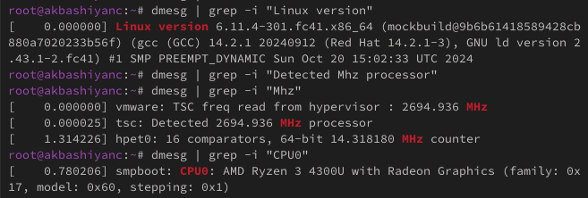{#fig:a111 width=70%}

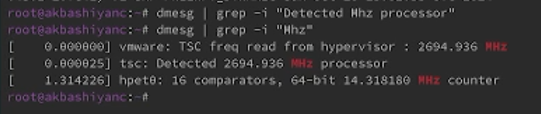{#fig:012 width=70%}

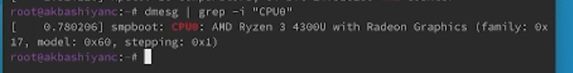{#fig:013 width=70%}

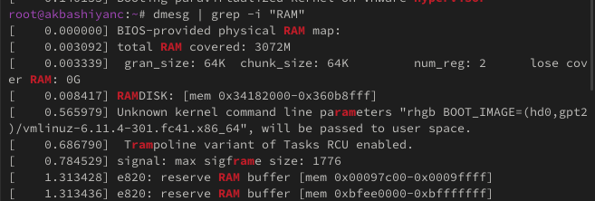{#fig:014 width=70%}

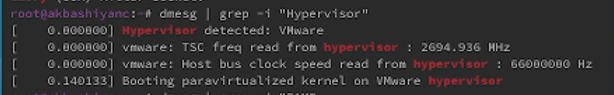{#fig:015 width=70%}

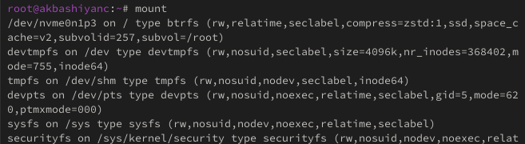{#fig:016 width=70%}

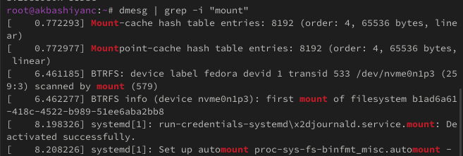{#fig:017 width=70%}

# Выводы

В этой лабораторной работе мы изучили работу виртуальной машины и ее настройки.

