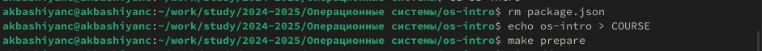

---
## Front matter
lang: ru-RU
title: Лабораторная работа №2
subtitle: Операционные системы
author:
  - Башиянц А. К.
institute:
  - Российский университет дружбы народов, Москва, Россия

date: 05 марта 2025

## i18n babel
babel-lang: russian
babel-otherlangs: english

## Formatting pdf
toc: false
toc-title: Содержание
slide_level: 2
aspectratio: 169
section-titles: true
theme: metropolis
header-includes:
 - \metroset{progressbar=frametitle,sectionpage=progressbar,numbering=fraction}
---

# Вводная часть

## Цели и задачи

Цель данной работы --- изучиение идеологий и применение средств контроля версий, освоение умений по работе с git.

* Делать базовую настройку git;

* Работать с ключами;

* Настраивать и работать с github.

# Выполнение лабораторной работы

## Установка программного обеспечения

{#fig:001 width=70%}

## Базовая настройка git

Сделаем базовые настройки git.

{#fig:002 width=70%}

## Ключи ssh

:::::::::::::: {.columns align=center}
::: {.column width="50%"}

Создадим ключ по алгоритму rsa с размером 4096 бит.

{#fig:003 width=100%}

:::
::: {.column width="50%"}

Создадим ключ по алгоритму ed25519.

{#fig:004 width=100%}

:::
::::::::::::::

## Ключи pgp

:::::::::::::: {.columns align=center}
::: {.column width="50%"}

{#fig:005 width=100%}

:::
::: {.column width="50%"}

{#fig:006 width=100%}

:::
::::::::::::::

## Добавление PGP ключа в GitHub

Выведем список ключей и скопируем отпечаток приватного ключа.

{#fig:007 width=70%}

## Настройка автоматических подписей коммитов git

Используя введёный email, укажем Git применять его при подписи коммитов.

{#fig:019 width=70%}

## Настройка gh

:::::::::::::: {.columns align=center}
::: {.column width="50%"}

{#fig:009 width=100%}

:::
::: {.column width="50%"}

{#fig:010 width=100%}

:::
::::::::::::::

## Шаблон для рабочего пространства

Перейдем в необходимый каталог и сколируем каталог.

{#fig:011 width=70%}

## Шаблон для рабочего пространства

Настроим каталог. Удалим лишние файлы, создадим необходимые файлы и закоммитим на сервер.d

{#fig:012 width=70%}

# Выводы

- В этой лабораторной работе мы изучили работу системы контроля версий и git. 
