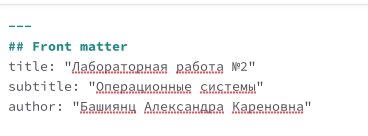
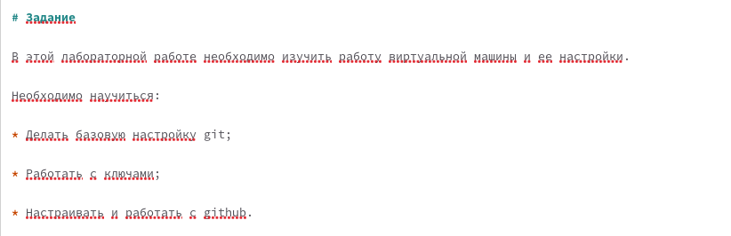
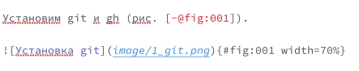
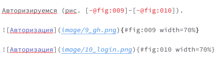
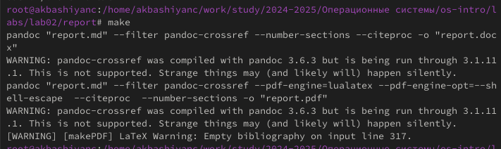
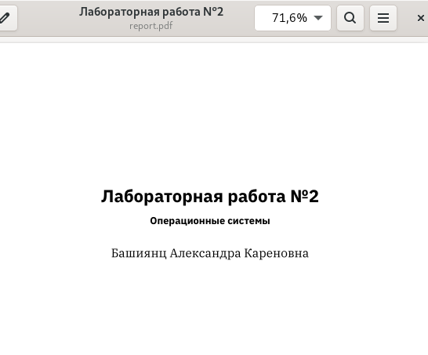

---
## Front matter
lang: ru-RU
title: Лабораторная работа №3
subtitle: Операционные системы
author:
  - Башиянц А. К.
institute:
  - Российский университет дружбы народов, Москва, Россия

date: 05 марта 2025

## i18n babel
babel-lang: russian
babel-otherlangs: english

## Formatting pdf
toc: false
toc-title: Содержание
slide_level: 2
aspectratio: 169
section-titles: true
theme: metropolis
header-includes:
 - \metroset{progressbar=frametitle,sectionpage=progressbar,numbering=fraction}
---

# Вводная часть

## Цели и задачи

Цель данной работы --- изучение оформления отчётов с помощью легковесного языка разметки Markdown.

* Создание заголовков;

* Создание списков;

* Вставка изображений;

* Ссылка на изображения.

# Выполнение лабораторной работы

## Заменя имени

{#fig:001 width=100%}

## Заголовки

{#fig:002 width=100%}

## Изображение

{#fig:003 width=100%}

## Ссылка на изображение

{#fig:004 width=70%}

## Ссылка на изображение

{#fig:005 width=70%}

## make

{#fig:006 width=70%}

## PDF

{#fig:008 width=70%}

# Выводы

- В этой лабораторной работе мы изучили работу Markdown.
