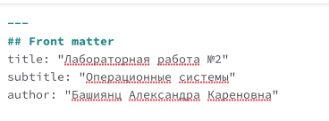
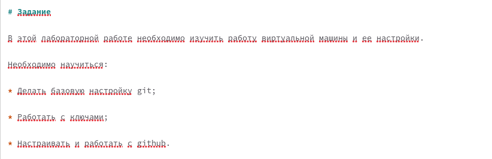
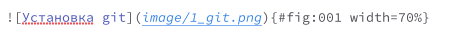
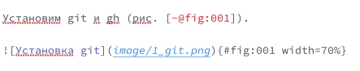
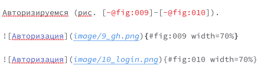
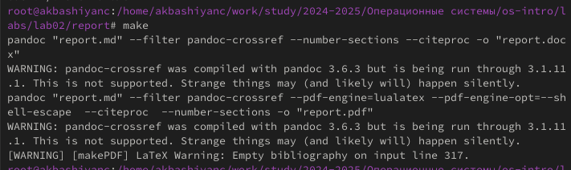
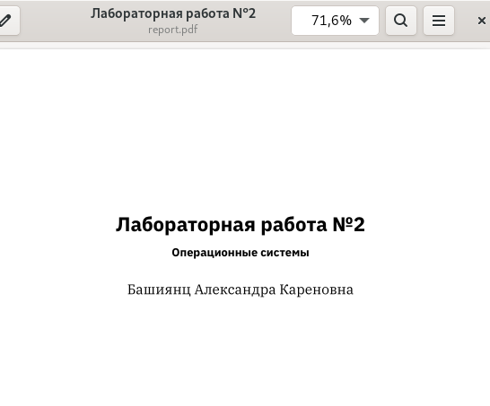

---
## Front matter
title: "Лабораторная работа №3"
subtitle: "Операционные системы"
author: "Башиянц Александра Кареновна"

## Generic otions
lang: ru-RU
toc-title: "Содержание"

## Bibliography
bibliography: bib/cite.bib
csl: pandoc/csl/gost-r-7-0-5-2008-numeric.csl

## Pdf output format
toc: true # Table of contents
toc-depth: 2
lof: true # List of figures
lot: false # List of tables
fontsize: 12pt
linestretch: 1.5
papersize: a4
documentclass: scrreprt
## I18n polyglossia
polyglossia-lang:
  name: russian
  options:
	- spelling=modern
	- babelshorthands=true
polyglossia-otherlangs:
  name: english
## I18n babel
babel-lang: russian
babel-otherlangs: english
## Fonts
mainfont: IBM Plex Serif
romanfont: IBM Plex Serif
sansfont: IBM Plex Sans
monofont: IBM Plex Mono
mathfont: STIX Two Math
mainfontoptions: Ligatures=Common,Ligatures=TeX,Scale=0.94
romanfontoptions: Ligatures=Common,Ligatures=TeX,Scale=0.94
sansfontoptions: Ligatures=Common,Ligatures=TeX,Scale=MatchLowercase,Scale=0.94
monofontoptions: Scale=MatchLowercase,Scale=0.94,FakeStretch=0.9
mathfontoptions:
## Biblatex
biblatex: true
biblio-style: "gost-numeric"
biblatexoptions:
  - parentracker=true
  - backend=biber
  - hyperref=auto
  - language=auto
  - autolang=other*
  - citestyle=gost-numeric
## Pandoc-crossref LaTeX customization
figureTitle: "Рис."
tableTitle: "Таблица"
listingTitle: "Листинг"
lofTitle: "Список иллюстраций"
lotTitle: "Список таблиц"
lolTitle: "Листинги"
## Misc options
indent: true
header-includes:
  - \usepackage{indentfirst}
  - \usepackage{float} # keep figures where there are in the text
  - \floatplacement{figure}{H} # keep figures where there are in the text
---

# Цель работы

Цель данной работы --- изучение оформления отчётов с помощью легковесного языка разметки Markdown.

# Задание

В этой лабораторной работе необходимо изучить оформление отчётов с помощью легковесного языка разметки Markdown.

Необходимо в Markdown научиться:

* Создание заголовков;

* Создание списков;

* Вставка изображений;

* Ссылка на изображения.

# Выполнение лабораторной работы

Заменим в шаблоне имя, название предмета и название отчета (рис. [-@fig:001]).

{#fig:001 width=100%}

Сделаем заголовки и подзаголовки с помощью # и ## (рис. [-@fig:002]).

{#fig:002 width=100%}

Вставим изображение, указав название, ссылку на место, где лежит, и уникальный тег, с помощью которого мы будет ссылаться на нее из текста (рис. [-@fig:003]).

{#fig:003 width=100%}

Вставим ссылку на изображение с помощью указанного тега (рис. [-@fig:004]).

{#fig:004 width=70%}

Если необходимо указать 2 и более изображения сразу, тоо это можно сделать так, как указано на рис. [-@fig:005].

{#fig:005 width=70%}

Выполним команду make,  чтобы у нас создались файлы docx и pdf (рис. [-@fig:006]).

{#fig:006 width=70%}

Проверим, что pdf создался корректно (рис. [-@fig:007]).

{#fig:008 width=70%}

# Выводы

В этой лабораторной работе мы изучили работу Markdown.

