---
## Front matter
lang: ru-RU
title: Лабораторная работа №4
subtitle: Операционные системы
author:
  - Башиянц А. К.
institute:
  - Российский университет дружбы народов, Москва, Россия

date: 05 марта 2025

## i18n babel
babel-lang: russian
babel-otherlangs: english

## Formatting pdf
toc: false
toc-title: Содержание
slide_level: 2
aspectratio: 169
section-titles: true
theme: metropolis
header-includes:
 - \metroset{progressbar=frametitle,sectionpage=progressbar,numbering=fraction}
---

# Вводная часть

## Цели и задачи

Цель данной работы --- приобрести практические навыки правильной работы с репозиториями git.

* Работать с git flow;

* Создавать ветки;

* Работать с журналом изменений;

* Создавать релизы.

# Выполнение лабораторной работы

## Установка copr

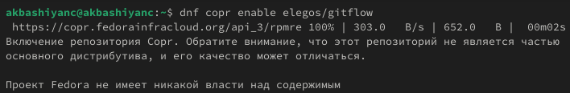{#fig:001 width=70%}

## Установка gitflow

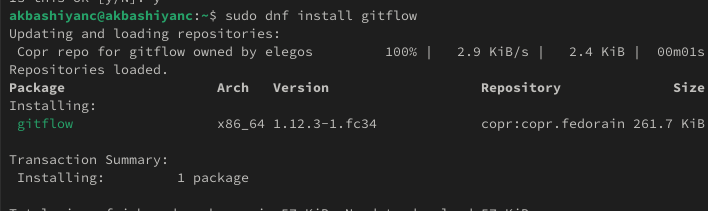{#fig:002 width=70%}

## Установка Node.js

{#fig:003 width=70%}

## Общепринятые коммиты

Выполним команду для помощи в форматировании коммитов.

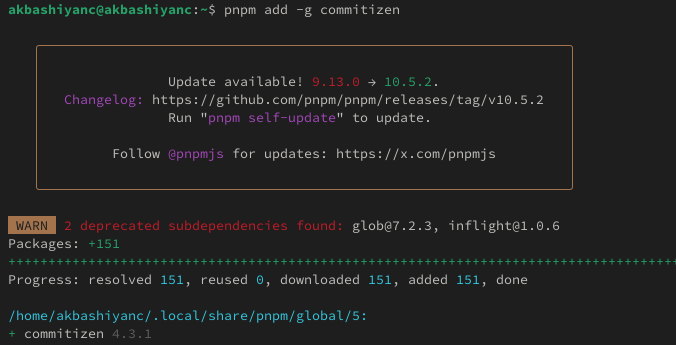{#fig:006 width=70%}

## Общепринятые коммиты

Выполним команду для помощи в создании логов.

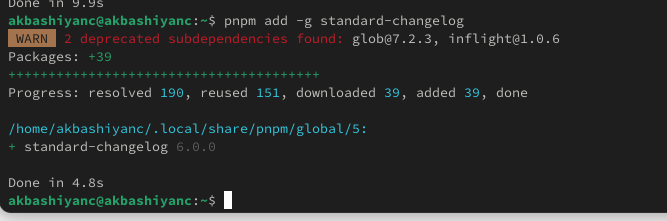{#fig:007 width=70%}

## Создание репозитория git

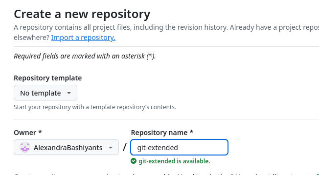{#fig:008 width=70%}

## Работа с репозиторием

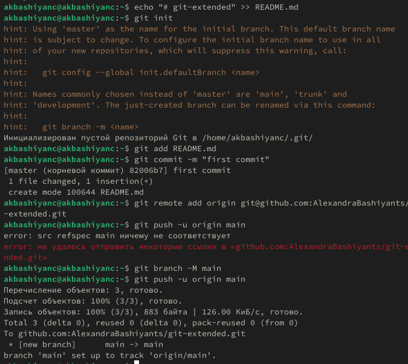{#fig:009 width=70%}

## package.json

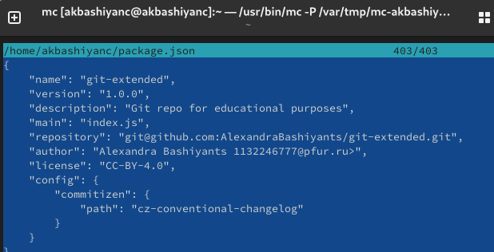{#fig:010 width=70%}

## git cz

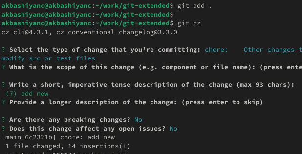{#fig:a111 width=70%}

## Инициализация git-flow

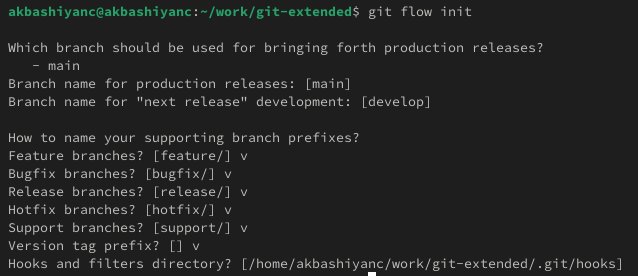{#fig:012 width=70%}

## git branch

Проверим, что Вы на ветке develop и загрузим весь репозиторий в хранилище.

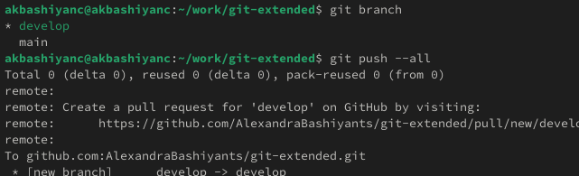{#fig:013 width=70%}

## Релиз 1.0.0

Установим внешнюю ветку как вышестоящую для этой ветки и Создадим релиз с версией 1.0.0.

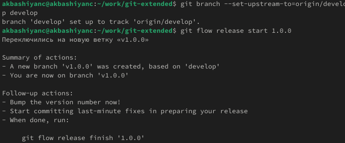{#fig:014 width=70%}

## Журнал изменений

Создадим журнал изменений, Добавим журнал изменений в индекс, Зальём релизную ветку в основную ветку

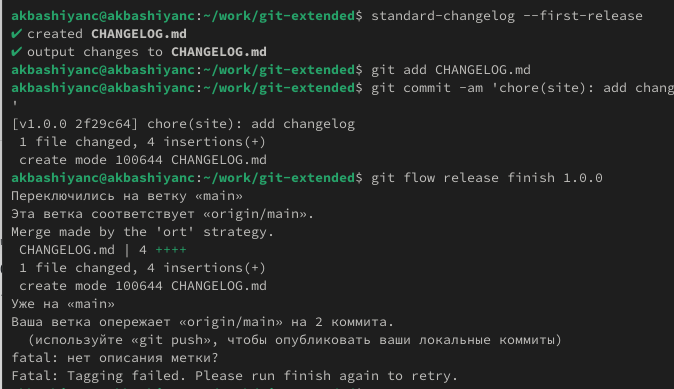{#fig:015 width=70%}

## git push --all

Отправим данные на github.

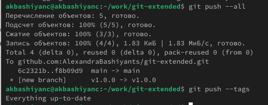{#fig:016 width=70%}

## Создание релиза

Создадим релиз на github. Для этого будем использовать утилиты работы с github.

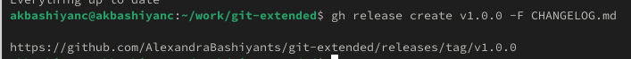{#fig:017 width=70%}

# Выводы

- В этой лабораторной работе мы изучили работу git.
