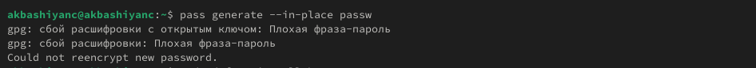
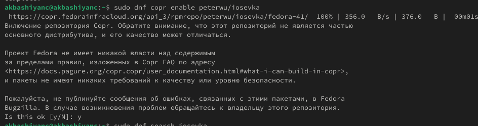

---
## Front matter
title: "Лабораторная работа №5"
subtitle: "Операционные системы"
author: "Башиянц Александра Кареновна"
## Generic otions
lang: ru-RU
toc-title: "Содержание"

## Bibliography
bibliography: bib/cite.bib
csl: pandoc/csl/gost-r-7-0-5-2008-numeric.csl

## Pdf output format
toc: true # Table of contents
toc-depth: 2
lof: true # List of figures
lot: false # List of tables
fontsize: 12pt
linestretch: 1.5
papersize: a4
documentclass: scrreprt
## I18n polyglossia
polyglossia-lang:
  name: russian
  options:
	- spelling=modern
	- babelshorthands=true
polyglossia-otherlangs:
  name: english
## I18n babel
babel-lang: russian
babel-otherlangs: english
## Fonts
mainfont: IBM Plex Serif
romanfont: IBM Plex Serif
sansfont: IBM Plex Sans
monofont: IBM Plex Mono
mathfont: STIX Two Math
mainfontoptions: Ligatures=Common,Ligatures=TeX,Scale=0.94
romanfontoptions: Ligatures=Common,Ligatures=TeX,Scale=0.94
sansfontoptions: Ligatures=Common,Ligatures=TeX,Scale=MatchLowercase,Scale=0.94
monofontoptions: Scale=MatchLowercase,Scale=0.94,FakeStretch=0.9
mathfontoptions:
## Biblatex
biblatex: true
biblio-style: "gost-numeric"
biblatexoptions:
  - parentracker=true
  - backend=biber
  - hyperref=auto
  - language=auto
  - autolang=other*
  - citestyle=gost-numeric
## Pandoc-crossref LaTeX customization
figureTitle: "Рис."
tableTitle: "Таблица"
listingTitle: "Листинг"
lofTitle: "Список иллюстраций"
lotTitle: "Список таблиц"
lolTitle: "Листинги"
## Misc options
indent: true
header-includes:
  - \usepackage{indentfirst}
  - \usepackage{float} # keep figures where there are in the text
  - \floatplacement{figure}{H} # keep figures where there are in the text
---

# Цель работы

Цель данной работы --- приобрести практические навыки настройки рабочей среды.

# Задание

В этой лабораторной работе необходимо изучить правильную настройку рабочей среды.

Необходимо научиться:

* Работать с менеджером паролей;

* Упралять файлами конфигурации;

* Работать с дополнительным ПО.

# Выполнение лабораторной работы

## Установка

Установим pass (рис. [-@fig:001]).

{#fig:001 width=70%}

Установим gopass (рис. [-@fig:002]).

{#fig:002 width=70%}

## Настройка

Проверим, что у нас есть ключ gpg и Иницилизируем хранилище (рис. [-@fig:003]).

{#fig:003 width=70%}

Синхронизируем с git. Создадим структуру git (рис. [-@fig:004]).

{#fig:004 width=70%}

## Настройка интерфейса с броузером

Установим плагин browserpass (рис. [-@fig:005] - [-@fig:006]).

{#fig:005 width=70%}

{#fig:006 width=70%}

## Сохранение пароля

Добавим новый пароль (рис. [-@fig:009]).

{#fig:009 width=70%}

Заменим существующий пароль (рис. [-@fig:010]).

{#fig:010 width=70%}

## Управление файлами конфигурации

Установим дополнительное программное обеспечение (рис. [-@fig:a111]).

{#fig:a111 width=70%}

Установим шрифты (рис. [-@fig:012]-[-@fig:212]).

{#fig:012 width=70%}

{#fig:112 width=70%}

{#fig:212 width=70%}

Установим бинарный файл (рис. [-@fig:014]).

{#fig:014 width=70%}

## Создание собственного репозитория с помощью утилит

Создадим свой репозиторий для конфигурационных файлов на основе шаблона (рис. [-@fig:015]).

{#fig:015 width=70%}

## Подключение репозитория к своей системе

Инициализируем chezmoi с вашим репозиторием dotfiles (рис. [-@fig:016]).

{#fig:016 width=70%}

Проверим, какие изменения внес chezmoi в домашний каталог (рис. [-@fig:017]).

{#fig:017 width=70%}

Нас устраивают изменения, внесённые chezmoi, поэтому запустим (рис. [-@fig:018]).

{#fig:018 width=70%}

## Использование chezmoi на нескольких машинах

На второй машине инициализируйте chezmoi с вашим репозиторием dotfiles (рис. [-@fig:019]).

{#fig:019 width=70%}

Проверим, какие изменения внесёт chezmoi в домашний каталог, запустив (рис. [-@fig:020]).

{#fig:020 width=70%}

Нас устраивают изменения, внесённые chezmoi, поэтому запустим (рис. [-@fig:021]).

{#fig:021 width=70%}

Можно автоматически фиксировать и отправлять изменения в исходный каталог в репозиторий. Эта функция отключена по умолчанию. Чтобы включить её, добавим в файл конфигурации (рис. [-@fig:022]).

{#fig:022 width=70%}

# Выводы

В этой лабораторной работе мы изучили настройку рабочей среды.

