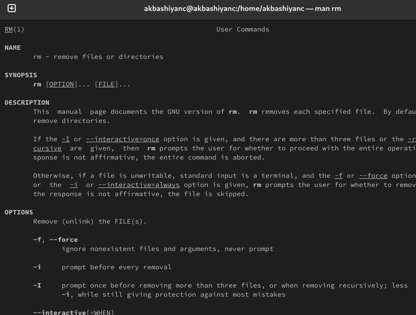

---
## Front matter
lang: ru-RU
title: Лабораторная работа №6
subtitle: Операционные системы
author:
  - Башиянц А. К.
institute:
  - Российский университет дружбы народов, Москва, Россия

date: 

## i18n babel
babel-lang: russian
babel-otherlangs: english

## Formatting pdf
toc: false
toc-title: Содержание
slide_level: 2
aspectratio: 169
section-titles: true
theme: metropolis
header-includes:
 - \metroset{progressbar=frametitle,sectionpage=progressbar,numbering=fraction}
---

# Вводная часть

## Цели и задачи

Цель данной работы --- приобретение практических навыков взаимодействия пользователя с системой посредством командной строки.

* Работать с директориями через командную строку;

* Получать информацию о командах;

* Создавать и удалять директории.

# Выполнение лабораторной работы

## Домашний каталог

{#fig:001 width=70%}

## ls

{#fig:002 width=70%}

## ls -l

{#fig:003 width=70%}

## ls -a

{#fig:004 width=70%}

## /var/spool

Определим, есть ли в каталоге /var/spool подкаталог с именем cron.

{#fig:005 width=70%}

## Владелец

{#fig:007 width=70%}

## Создание каталогов

{#fig:008 width=70%}

## Создание каталогов одной командой

{#fig:039 width=70%}

## Удаление каталогов одной командой

{#fig:009 width=70%}

## Попытка удаления

{#fig:010 width=70%}

## man ls

{#fig:011 width=70%}

## ls -R

С помощью команды man определим, какую опцию команды ls нужно использовать для просмотра содержимое не только указанного каталога, но и подкаталогов, входящих в него. Для этого нужно дописать -R.

{#fig:012 width=70%}

## ls -l --time=ctime

С помощью команды man определим набор опций команды ls, позволяющий отсортировать по времени последнего изменения выводимый список содержимого каталога с развёрнутым описанием файлов. Для этого нужно дописать --time=ctime.

{#fig:013 width=70%}

## man cd

{#fig:014 width=70%}

## man pwd

{#fig:015 width=70%}

## man mkdir

{#fig:016 width=70%}

## man rm

{#fig:017 width=70%}

## man ls

{#fig:018 width=70%}

# Выводы

- В этой лабораторной работе мы изучили взаимодействие пользователя с системой посредством командной строки.
