---
## Front matter
title: "Лабораторная работа №6"
subtitle: "Операционные системы"
author: "Башиянц Александра Кареновна"
## Generic otions
lang: ru-RU
toc-title: "Содержание"

## Bibliography
bibliography: bib/cite.bib
csl: pandoc/csl/gost-r-7-0-5-2008-numeric.csl

## Pdf output format
toc: true # Table of contents
toc-depth: 2
lof: true # List of figures
lot: false # List of tables
fontsize: 12pt
linestretch: 1.5
papersize: a4
documentclass: scrreprt
## I18n polyglossia
polyglossia-lang:
  name: russian
  options:
	- spelling=modern
	- babelshorthands=true
polyglossia-otherlangs:
  name: english
## I18n babel
babel-lang: russian
babel-otherlangs: english
## Fonts
mainfont: IBM Plex Serif
romanfont: IBM Plex Serif
sansfont: IBM Plex Sans
monofont: IBM Plex Mono
mathfont: STIX Two Math
mainfontoptions: Ligatures=Common,Ligatures=TeX,Scale=0.94
romanfontoptions: Ligatures=Common,Ligatures=TeX,Scale=0.94
sansfontoptions: Ligatures=Common,Ligatures=TeX,Scale=MatchLowercase,Scale=0.94
monofontoptions: Scale=MatchLowercase,Scale=0.94,FakeStretch=0.9
mathfontoptions:
## Biblatex
biblatex: true
biblio-style: "gost-numeric"
biblatexoptions:
  - parentracker=true
  - backend=biber
  - hyperref=auto
  - language=auto
  - autolang=other*
  - citestyle=gost-numeric
## Pandoc-crossref LaTeX customization
figureTitle: "Рис."
tableTitle: "Таблица"
listingTitle: "Листинг"
lofTitle: "Список иллюстраций"
lotTitle: "Список таблиц"
lolTitle: "Листинги"
## Misc options
indent: true
header-includes:
  - \usepackage{indentfirst}
  - \usepackage{float} # keep figures where there are in the text
  - \floatplacement{figure}{H} # keep figures where there are in the text
---

# Цель работы

Цель данной работы --- приобретение практических навыков взаимодействия пользователя с системой посредством командной строки.

# Задание

В этой лабораторной работе необходимо изучить правильное взаимодействие с системой.

Необходимо научиться:

* Работать с директориями через командную строку;

* Получать информацию о командах;

* Создавать и удалять директории.

# Выполнение лабораторной работы

Определим полное имя нашего домашнего каталога. Далее относительно этого каталога мы будем выполнять последующие упражнения (рис. [-@fig:001]).

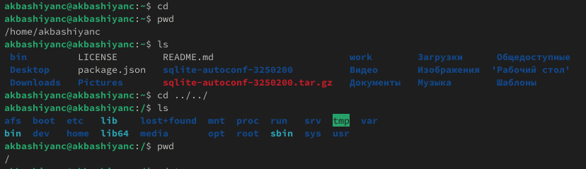{#fig:001 width=70%}

Перейдём в каталог /tmp. Выведем на экран содержимое каталога /tmp. Для этого используем команду ls с различными опциями (рис. [-@fig:002] - [-@fig:004]).
Ы
Поясним разницу в выводимой на экран информации. Если использовать просто ls, то выведятся только имена директорий. Если использовать флаг -l (рис. [-@fig:003]), то выведиться длинная информация, а если -a (рис. [-@fig:004]), то все файлы, включая скрытые.

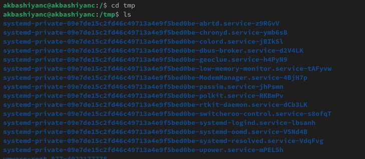{#fig:002 width=70%}

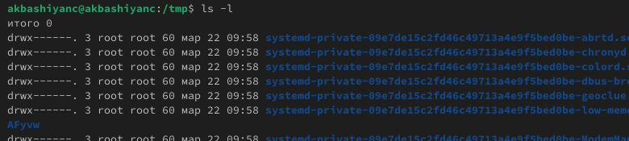{#fig:003 width=70%}

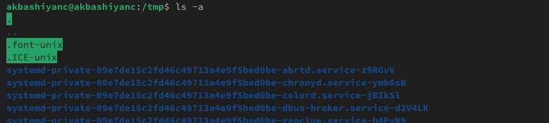{#fig:004 width=70%}

Определим, есть ли в каталоге /var/spool подкаталог с именем cron (рис. [-@fig:005]). Получается, что нет.

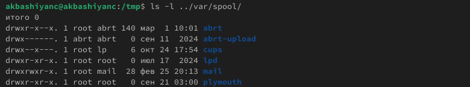{#fig:005 width=70%}

Определим, кто является владельцем файлов и подкаталогов (рис. [-@fig:007]).

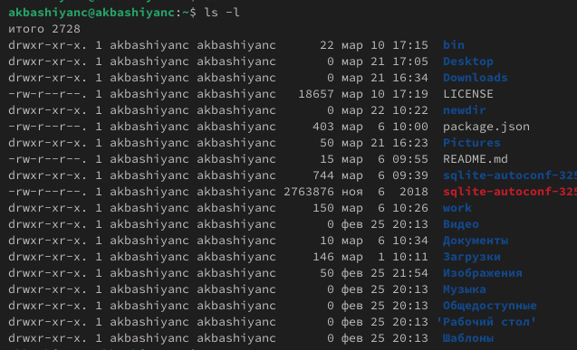{#fig:007 width=70%}

В домашнем каталоге создадим новый каталог с именем newdir. В каталоге ~/newdir создадим новый каталог с именем morefun (рис. [-@fig:008]).

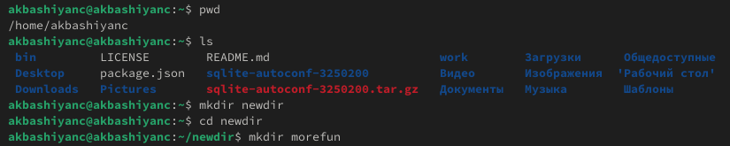{#fig:008 width=70%}

В домашнем каталоге создадим одной командой три новых каталога с именами letters, memos, misk (рис. [-@fig:039]).

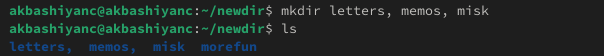{#fig:039 width=70%}

Удалим эти каталоги одной командой (рис. [-@fig:009]).

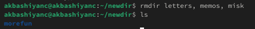{#fig:009 width=70%}

Попробуем удалить ранее созданный каталог ~/newdir командой rm. Также удалим каталог ~/newdir/morefun из домашнего каталога. Проверим, был ли каталог удалён  (рис. [-@fig:010]).

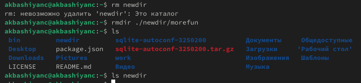{#fig:010 width=70%}

Откроем man ls (рис. [-@fig:011]).

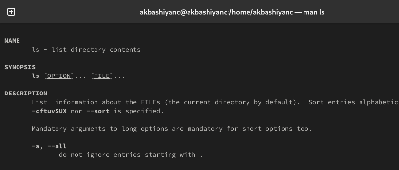{#fig:011 width=70%}

С помощью команды man определим, какую опцию команды ls нужно использовать для просмотра содержимое не только указанного каталога, но и подкаталогов, входящих в него. Для этого нужно дописать -R (рис. [-@fig:012]).

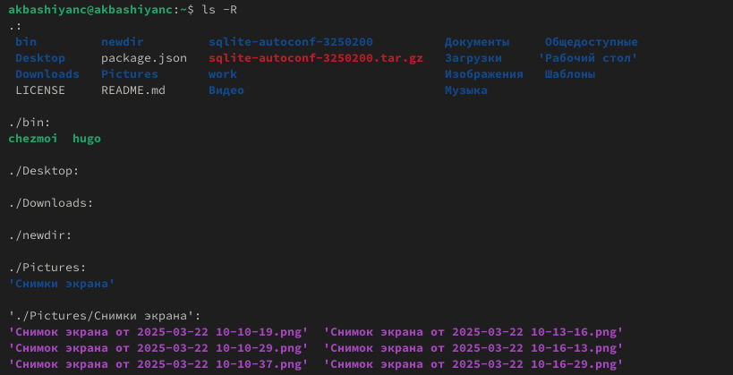{#fig:012 width=70%}

С помощью команды man определим набор опций команды ls, позволяющий отсортировать по времени последнего изменения выводимый список содержимого каталога с развёрнутым описанием файлов. Для этого нужно дописать --time=ctime (рис. [-@fig:013]).

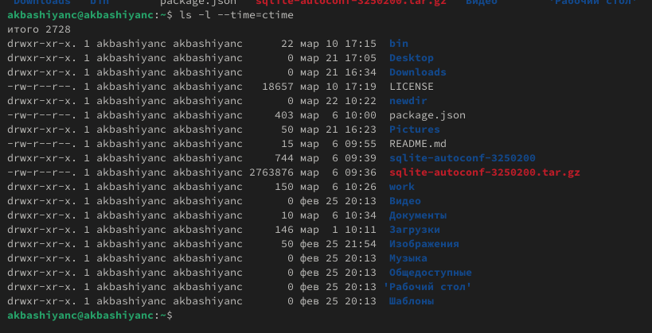{#fig:013 width=70%}

Используем команду man для просмотра описания следующих команд: cd, pwd, mkdir, rmdir, rm (рис. [-@fig:014] - [-@fig:018]).

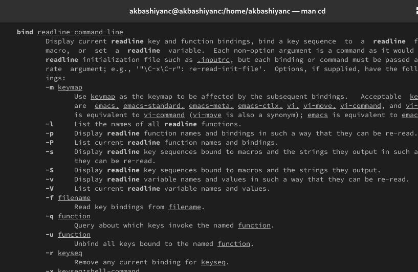{#fig:014 width=70%}

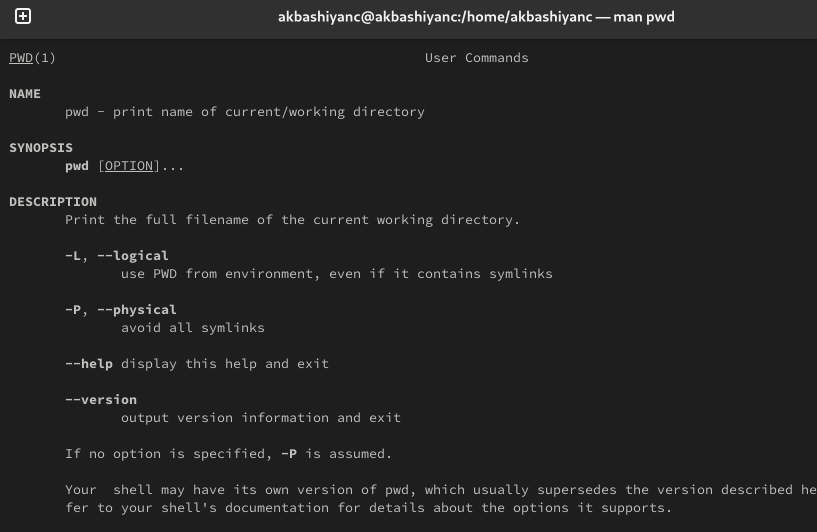{#fig:015 width=70%}

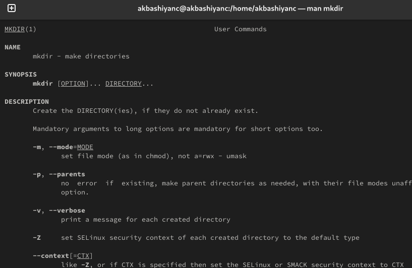{#fig:016 width=70%}

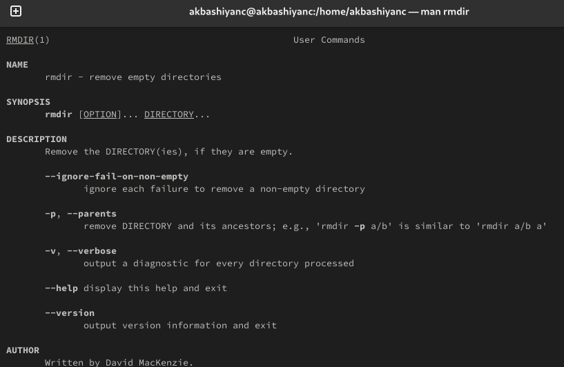{#fig:017 width=70%}

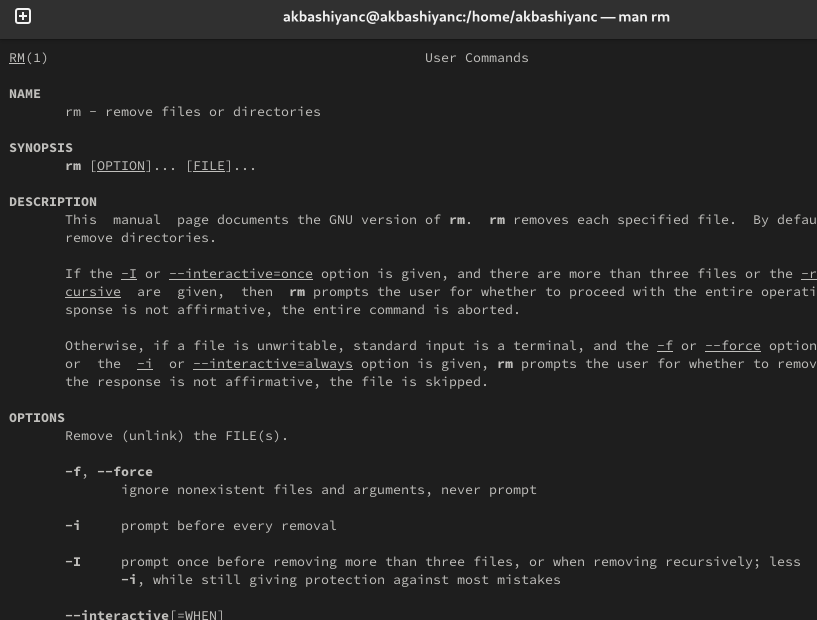{#fig:018 width=70%}

# Выводы

В этой лабораторной работе мы изучили взаимодействие пользователя с системой посредством командной строки.

