---
## Front matter
lang: ru-RU
title: Лабораторная работа №7
subtitle: Операционные системы
author:
  - Башиянц А. К.
institute:
  - Российский университет дружбы народов, Москва, Россия

date: 

## i18n babel
babel-lang: russian
babel-otherlangs: english

## Formatting pdf
toc: false
toc-title: Содержание
slide_level: 2
aspectratio: 169
section-titles: true
theme: metropolis
header-includes:
 - \metroset{progressbar=frametitle,sectionpage=progressbar,numbering=fraction}
---

# Вводная часть

## Цели и задачи

Цель данной работы --- приобретение практических навыков работы с файловой системой.

* Создавать файлы;

* Копировать файлы и директории;

* Перемещать файлы и директории;

* Настраивать права доступа к файлам и директориям.

# Выполнение лабораторной работы

## Копирование файла в текущем каталоге

Скопируем файл ~/abc1 в файл april и в файл may.

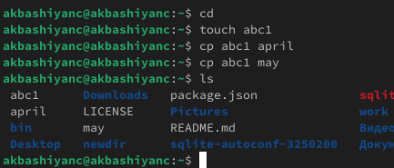{#fig:001 width=70%}

## Копирование нескольких файлов в каталог

Скопируем файлы april и may в каталог monthly.

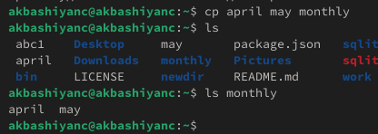{#fig:002 width=70%}

## Копирование файлов в произвольном каталоге

Скопируем файл monthly/may в файл с именем june.

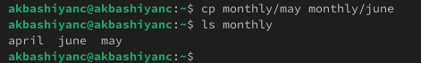{#fig:003 width=70%}

## Копирование каталогов в текущем каталоге

Скопируем каталог monthly в каталог monthly.00.

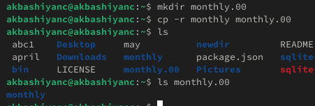{#fig:004 width=70%}

## Копирование каталогов в произвольном каталоге

Скопируем каталог monthly.00 в каталог /tmp.

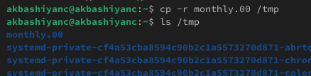{#fig:005 width=70%}

## Переименование файлов в текущем каталоге

Изменим название файла april на july в домашнем каталоге.

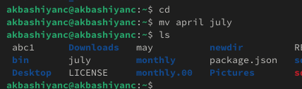{#fig:006 width=70%}

## Перемещение файлов в другой каталог

Переместим файл july в каталог monthly.00.

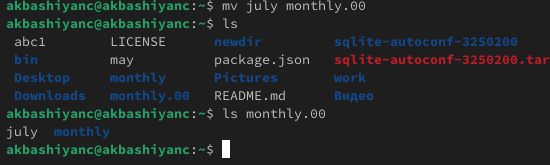{#fig:007 width=70%}

## Переименование каталогов в текущем каталоге

Переименовать каталог monthly.00 в monthly.01.

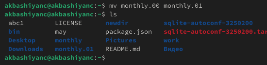{#fig:008 width=70%}

## Перемещение каталога в другой каталог

Переместим кереименование каталогов в таталог monthly.01 в каталог reports.

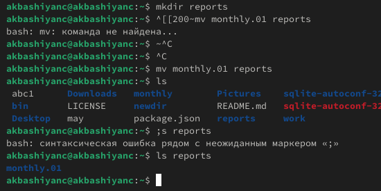{#fig:009 width=70%}

## Переименование каталога, не являющегося текущим

Переименовать каталог reports/monthly.01 в reports/monthly.

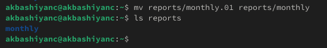{#fig:010 width=70%}

## Право выполнения для владельца

Создадим файл ~/may с правом выполнения для владельца.

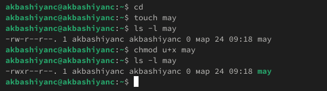{#fig:011 width=70%}

## Лишение права

Лишим владельца файла ~/may права на выполнение.

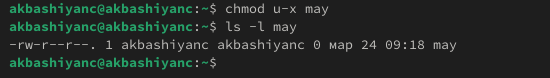{#fig:012 width=70%}

## Запрет на чтение

Создадим каталог monthly с запретом на чтение для членов группы и всех остальных пользователей.

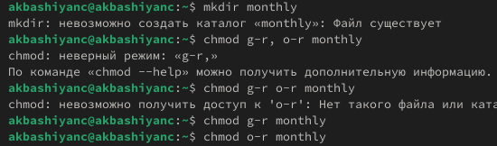{#fig:013 width=70%}

## Право записи для группы

Создадим файл ~/abc1 с правом записи для членов группы.

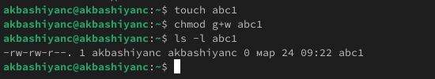{#fig:014 width=70%}

## equipment

Скопируем файл /usr/include/sys/io.h в домашний каталог и назовём его equipment. Для этого используем команду cp.

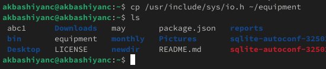{#fig:021 width=70%}

## mv equipment

Переместим файл equipment в каталог ~/ski.plases. Для этого используем команду mv.

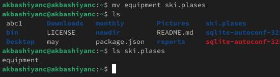{#fig:023 width=70%}

## mv equipment

Переименуем файл ~/ski.plases/equipment в ~/ski.plases/equiplist. Для этого используем команду mv.

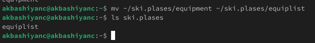{#fig:024 width=70%}

## equipment

Создадим в домашнем каталоге файл abc1 и скопируем его в каталог ~/ski.plases, назовём его equiplist2. Для этого используем команду cp.

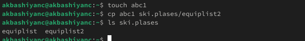{#fig:025 width=70%}

## mkdir equipment

Создадим каталог с именем equipment в каталоге ~/ski.plases. Для этого используем команду mkdir.

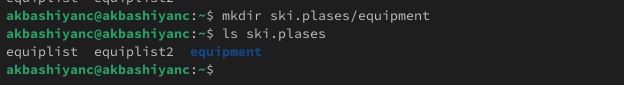{#fig:026 width=70%}

## mv equipment

Переместим файлы ~/ski.plases/equiplist и equiplist2 в каталог ~/ski.plases/equipment. Для этого используем команду mv).

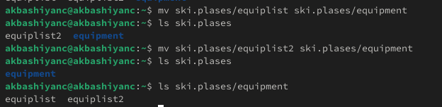{#fig:027 width=70%}

## mv equipment

Создадим и переместим каталог ~/newdir в каталог ~/ski.plases и назовём его plans. Для этого используем команду mv.

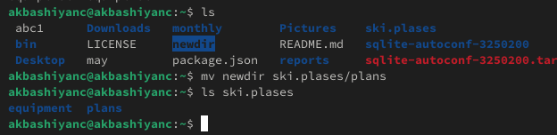{#fig:028 width=70%}

## chmod для директорий

Создадим директории australia и play, и с помощью chmod изменим права.

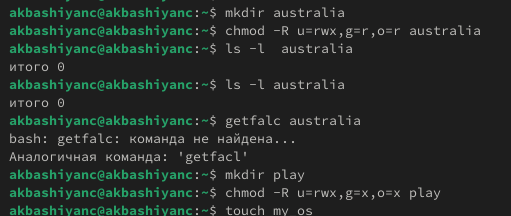{#fig:031 width=70%}

## chmod для файлов

Создадим файлы my_os и feathers, и с помощью chmod изменим права.

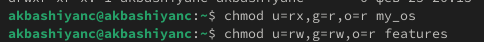{#fig:032 width=70%}

## cp feathers

Скопируем файл ~/feathers в файл ~/files.old. Для этого используем команду cp.

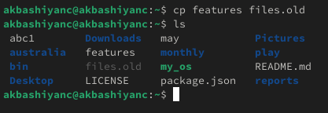{#fig:042 width=70%}

## mv files.old

Переместим файл ~/files.old в каталог ~/play. Для этого используем команду mv.

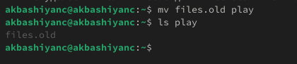{#fig:043 width=70%}

## cp play

Скопируем каталог ~/play в каталог ~/fun. Для этого используем команду cp.

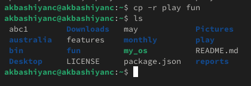{#fig:044 width=70%}

## mv fun

Переместим каталог ~/fun в каталог ~/play и назовём его games. Для этого используем команду mv.

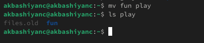{#fig:045 width=70%}

## chmod feathers

Лишим владельца файла ~/feathers права на чтение. Заметим, что теперь мы не можем читать файл. Вернем все обратно /

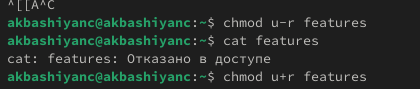{#fig:046 width=70%}

## chmod play

Лишим владельца каталога ~/play права на выполнение. Заметим, что теперь мы не можем выполнять команды с каталогом и файлами внутри. Вернем все обратно.

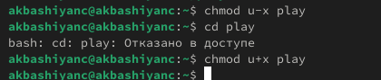{#fig:047 width=70%}

## man mount

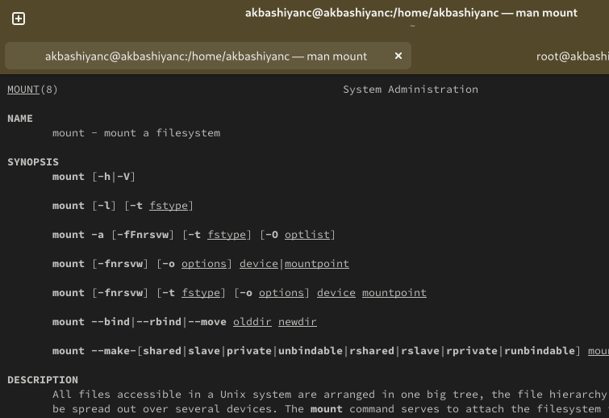{#fig:051 width=70%}

## man fsck

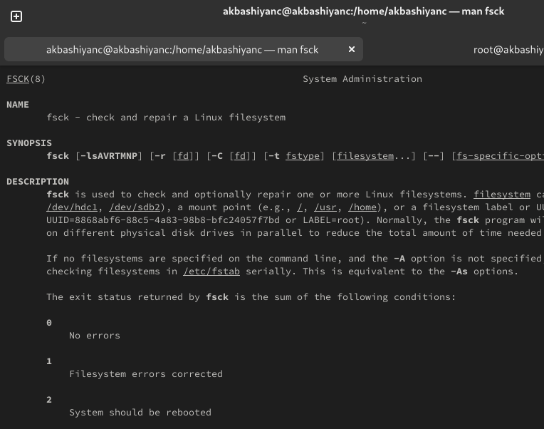{#fig:052 width=70%}

## man mkfs

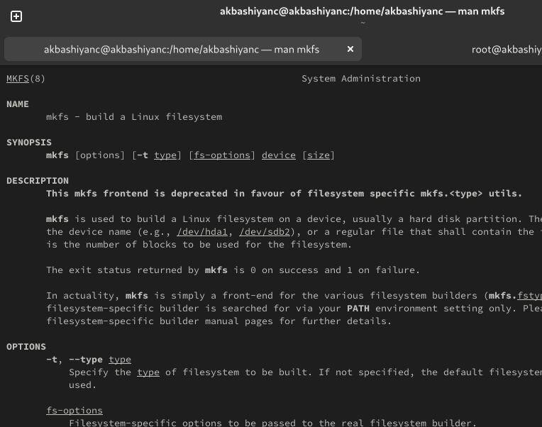{#fig:053 width=70%}

## man kill

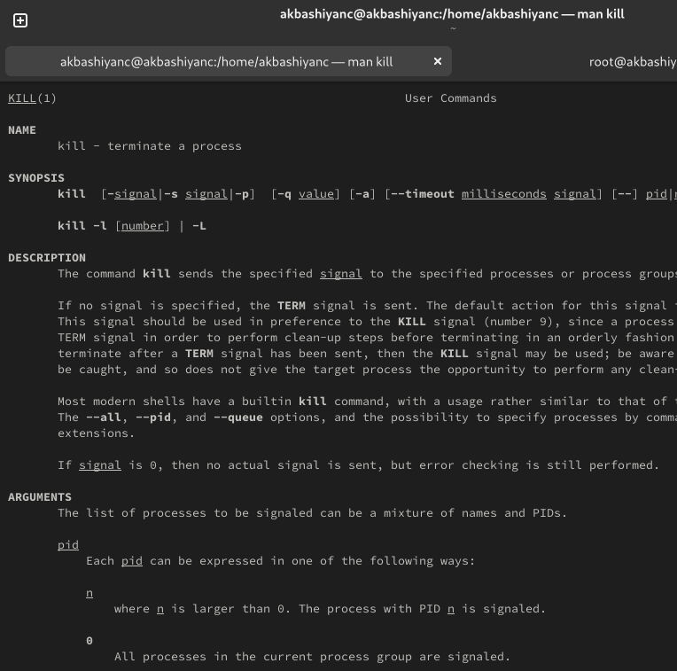{#fig:054 width=70%}

# Выводы

- В этой лабораторной работе мы изучили работу с файловой системой.
