---
## Front matter
title: "Лабораторная работа №7"
subtitle: "Операционные системы"
author: "Башиянц Александра Кареновна"
## Generic otions
lang: ru-RU
toc-title: "Содержание"

## Bibliography
bibliography: bib/cite.bib
csl: pandoc/csl/gost-r-7-0-5-2008-numeric.csl

## Pdf output format
toc: true # Table of contents
toc-depth: 2
lof: true # List of figures
lot: false # List of tables
fontsize: 12pt
linestretch: 1.5
papersize: a4
documentclass: scrreprt
## I18n polyglossia
polyglossia-lang:
  name: russian
  options:
	- spelling=modern
	- babelshorthands=true
polyglossia-otherlangs:
  name: english
## I18n babel
babel-lang: russian
babel-otherlangs: english
## Fonts
mainfont: IBM Plex Serif
romanfont: IBM Plex Serif
sansfont: IBM Plex Sans
monofont: IBM Plex Mono
mathfont: STIX Two Math
mainfontoptions: Ligatures=Common,Ligatures=TeX,Scale=0.94
romanfontoptions: Ligatures=Common,Ligatures=TeX,Scale=0.94
sansfontoptions: Ligatures=Common,Ligatures=TeX,Scale=MatchLowercase,Scale=0.94
monofontoptions: Scale=MatchLowercase,Scale=0.94,FakeStretch=0.9
mathfontoptions:
## Biblatex
biblatex: true
biblio-style: "gost-numeric"
biblatexoptions:
  - parentracker=true
  - backend=biber
  - hyperref=auto
  - language=auto
  - autolang=other*
  - citestyle=gost-numeric
## Pandoc-crossref LaTeX customization
figureTitle: "Рис."
tableTitle: "Таблица"
listingTitle: "Листинг"
lofTitle: "Список иллюстраций"
lotTitle: "Список таблиц"
lolTitle: "Листинги"
## Misc options
indent: true
header-includes:
  - \usepackage{indentfirst}
  - \usepackage{float} # keep figures where there are in the text
  - \floatplacement{figure}{H} # keep figures where there are in the text
---

# Цель работы

Цель данной работы --- приобретение практических навыков работы с файловой системой.

# Задание

В этой лабораторной работе необходимо изучить работу с файловой системой.

Необходимо научиться:

* Создавать файлы;

* Копировать файлы и директории;

* Перемещать файлы и директории;

* Настраивать права доступа к файлам и директориям.

# Выполнение лабораторной работы

Скопируем файл ~/abc1 в файл april и в файл may (рис. [-@fig:001]).

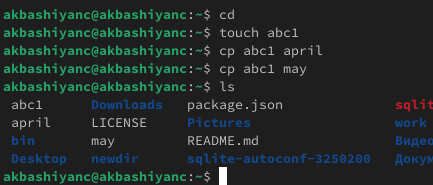{#fig:001 width=70%}

Скопируем файлы april и may в каталог monthly (рис. [-@fig:002]).

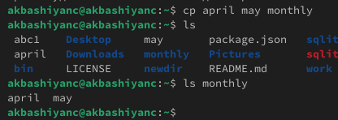{#fig:002 width=70%}

Скопируем файл monthly/may в файл с именем june (рис. [-@fig:003]).

{#fig:003 width=70%}

Скопируем каталог monthly в каталог monthly.00 (рис. [-@fig:004]).

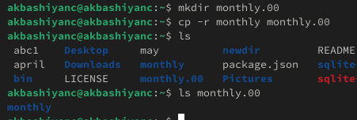{#fig:004 width=70%}

Скопируем каталог monthly.00 в каталог /tmp (рис. [-@fig:005]).

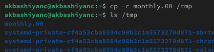{#fig:005 width=70%}

Изменим название файла april на july в домашнем каталоге (рис. [-@fig:006]).

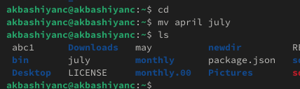{#fig:006 width=70%}

Переместим файл july в каталог monthly.00 (рис. [-@fig:007]).

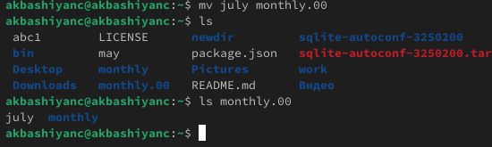{#fig:007 width=70%}

Переименовать каталог monthly.00 в monthly.01 (рис. [-@fig:008]).

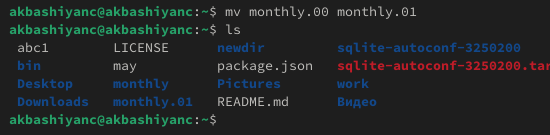{#fig:008 width=70%}

Переместим каталог monthly.01 в каталог reports (рис. [-@fig:009]).

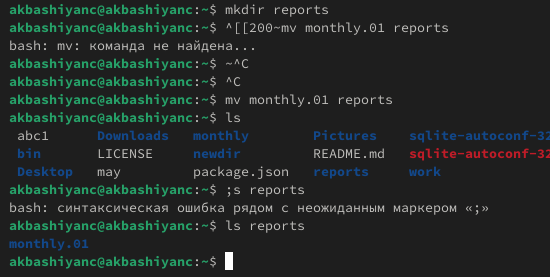{#fig:009 width=70%}

Переименовать каталог reports/monthly.01 в reports/monthly (рис. [-@fig:010]).

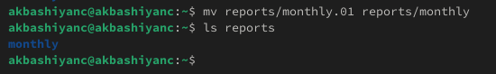{#fig:010 width=70%}

Создадим файл ~/may с правом выполнения для владельца (рис. [-@fig:011]).

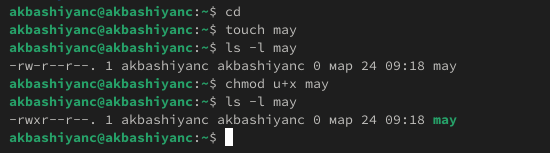{#fig:011 width=70%}

Лишим владельца файла ~/may права на выполнение (рис. [-@fig:012]).

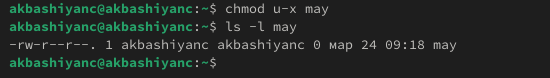{#fig:012 width=70%}

Создадим каталог monthly с запретом на чтение для членов группы и всех остальных пользователей (рис. [-@fig:013]).

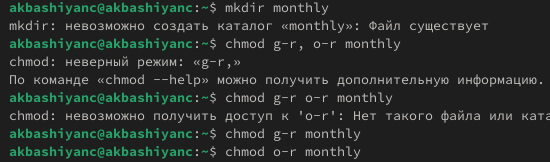{#fig:013 width=70%}

Создадим файл ~/abc1 с правом записи для членов группы (рис. [-@fig:014]).

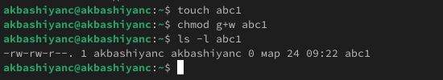{#fig:014 width=70%}

Скопируем файл /usr/include/sys/io.h в домашний каталог и назовём его equipment. Для этого используем команду cp (рис. [-@fig:021]).

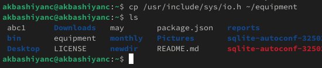{#fig:021 width=70%}

Переместим файл equipment в каталог ~/ski.plases. Для этого используем команду mv (рис. [-@fig:023]).

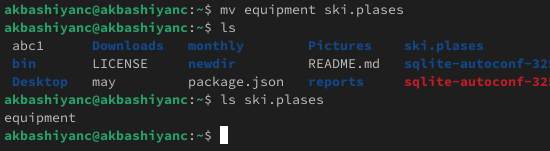{#fig:023 width=70%}

Переименуем файл ~/ski.plases/equipment в ~/ski.plases/equiplist. Для этого используем команду mv (рис. [-@fig:024]).

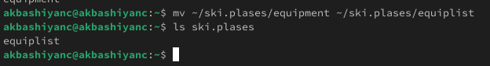{#fig:024 width=70%}

Создадим в домашнем каталоге файл abc1 и скопируем его в каталог ~/ski.plases, назовём его equiplist2. Для этого используем команду cp (рис. [-@fig:025]).

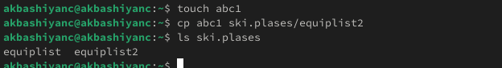{#fig:025 width=70%}

Создадим каталог с именем equipment в каталоге ~/ski.plases. Для этого используем команду mkdir (рис. [-@fig:026]).

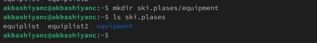{#fig:026 width=70%}

Переместим файлы ~/ski.plases/equiplist и equiplist2 в каталог ~/ski.plases/equipment. Для этого используем команду mv (рис. [-@fig:027]).

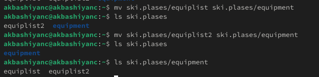{#fig:027 width=70%}

Создадим и переместим каталог ~/newdir в каталог ~/ski.plases и назовём его plans. Для этого используем команду mv (рис. [-@fig:028]).

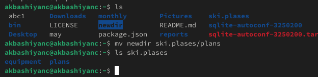{#fig:028 width=70%}

Создадим директории australia и play, и с помощью chmod изменим права (рис. [-@fig:031]).

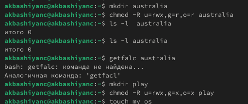{#fig:031 width=70%}

Создадим файлы my_os и feathers, и с помощью chmod изменим права (рис. [-@fig:032]).

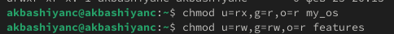{#fig:032 width=70%}

Скопируем файл ~/feathers в файл ~/files.old. Для этого используем команду cp (рис. [-@fig:042]).

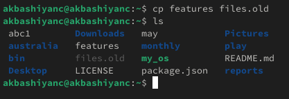{#fig:042 width=70%}

Переместим файл ~/files.old в каталог ~/play. Для этого используем команду mv (рис. [-@fig:043]).

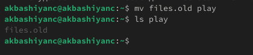{#fig:043 width=70%}

Скопируем каталог ~/play в каталог ~/fun. Для этого используем команду cp (рис. [-@fig:044]).

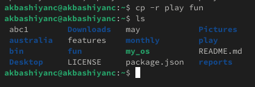{#fig:044 width=70%}

Переместим каталог ~/fun в каталог ~/play и назовём его games. Для этого используем команду mv (рис. [-@fig:045]).

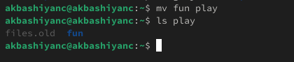{#fig:045 width=70%}

Лишим владельца файла ~/feathers права на чтение. Заметим, что теперь мы не можем читать файл. Вернем все обратно (рис. [-@fig:046]).

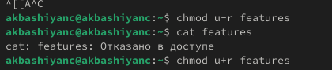{#fig:046 width=70%}

Лишим владельца каталога ~/play права на выполнение. Заметим, что теперь мы не можем выполнять команды с каталогом и файлами внутри. Вернем все обратно (рис. [-@fig:047]).

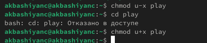{#fig:047 width=70%}

Прочитаем man по командам mount, fsck, mkfs, kill (рис. [-@fig:051]-[-@fig:054]).

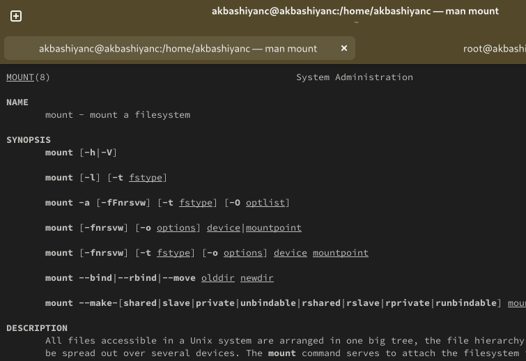{#fig:051 width=70%}

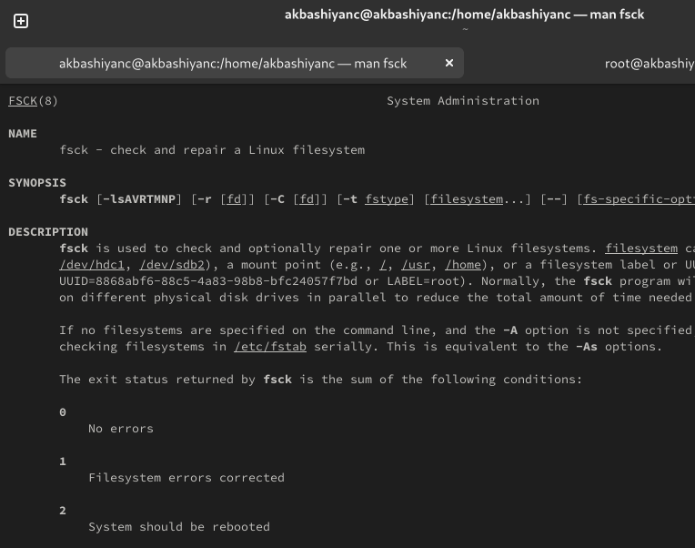{#fig:052 width=70%}

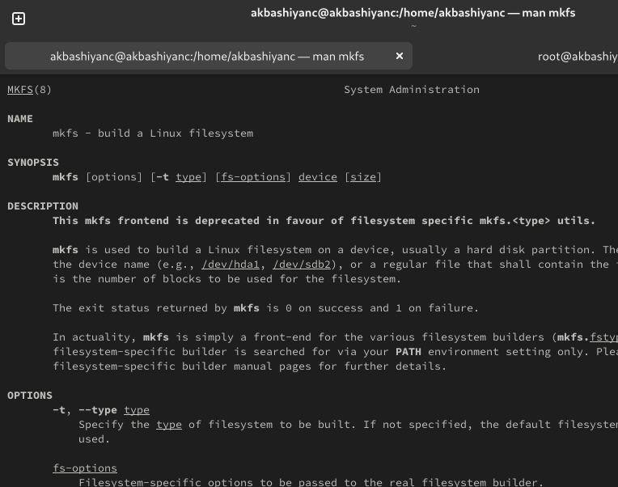{#fig:053 width=70%}

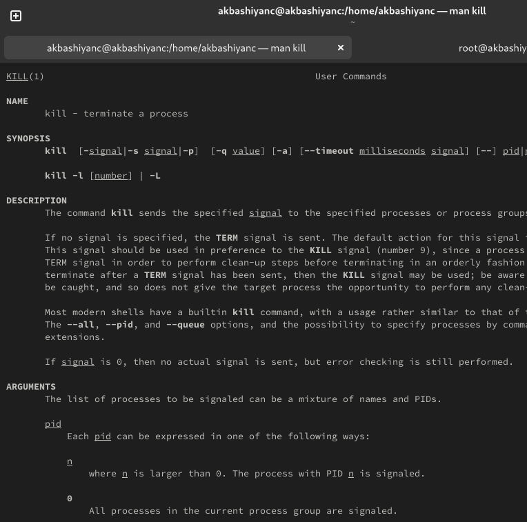{#fig:054 width=70%}

# Выводы

В этой лабораторной работе мы изучили работу с файловой системой.

