---
## Front matter
lang: ru-RU
title: Лабораторная работа №8
subtitle: Операционные системы
author:
  - Башиянц А. К.
institute:
  - Российский университет дружбы народов, Москва, Россия

date: 

## i18n babel
babel-lang: russian
babel-otherlangs: english

## Formatting pdf
toc: false
toc-title: Содержание
slide_level: 2
aspectratio: 169
section-titles: true
theme: metropolis
header-includes:
 - \metroset{progressbar=frametitle,sectionpage=progressbar,numbering=fraction}
---

# Вводная часть

## Цели и задачи

Цель данной работы --- приобретение практических навыков поиска файлов и фильтрации текстовых данных.

* Управлять процессами;

* Проверять использование диска;

* Обслуживание файловых систем.

# Выполнение лабораторной работы

## file.txt

Запишем в файл file.txt названия файлов, содержащихся в каталоге /etc. Допишем в этот же файл названия файлов, содержащихся в нашем домашнем каталоге.

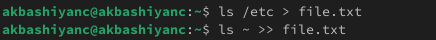{#fig:001 width=70%}

## conf.txt

Выведем имена всех файлов из file.txt, имеющих расширение .conf, после чего запишем их в новый текстовой файл conf.txt.

{#fig:002 width=70%}

## Файлы на с

Определим, какие файлы в нашем домашнем каталоге имеют имена, начинавшиеся с символа c? Предложим несколько вариантов, как это сделать.

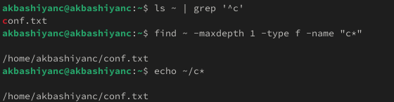{#fig:004 width=70%}

## Файлы на h

Выведем на экран (по странично) имена файлов из каталога /etc, начинающиеся с символа h.

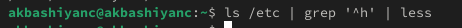{#fig:005 width=70%}

## Просмотр

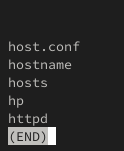{#fig:006 width=70%}

## logfile

Запустим в фоновом режиме процесс, который будет записывать в файл ~/logfile файлы, имена которых начинаются с log.

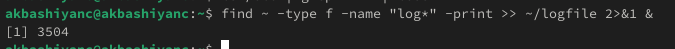{#fig:007 width=70%}

## rm logfile

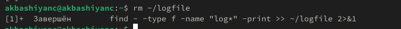{#fig:008 width=70%}

## gedit &

Запустим из консоли в фоновом режиме редактор gedit.

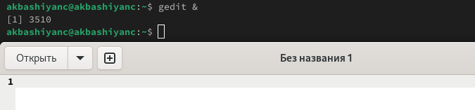{#fig:009 width=70%}

## Идентификатор процесса

Определим идентификатор процесса gedit, используя команду ps, конвейер и фильтр grep.

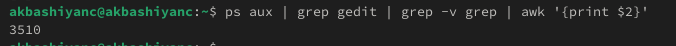{#fig:010 width=70%}

## man kill

Прочтем справку (man) команды kill, после чего используем её для завершения процесса gedit. 

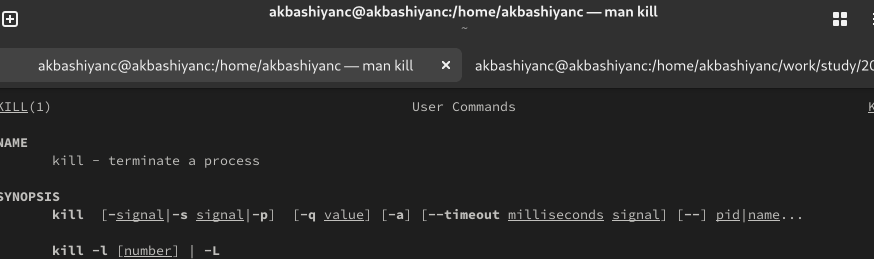{#fig:011 width=70%}

## kill gedit

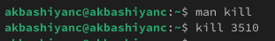{#fig:012 width=70%}

## man df

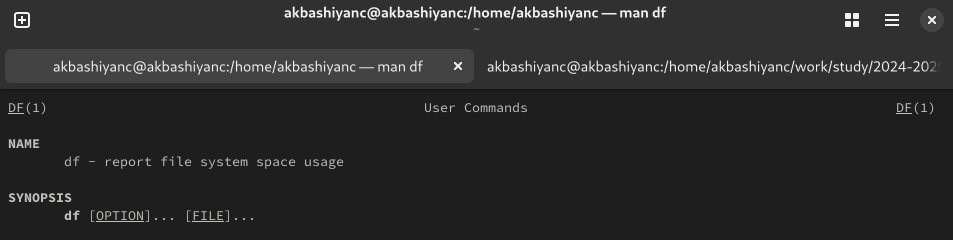{#fig:013 width=70%}

## man du

{#fig:014 width=70%}

## df

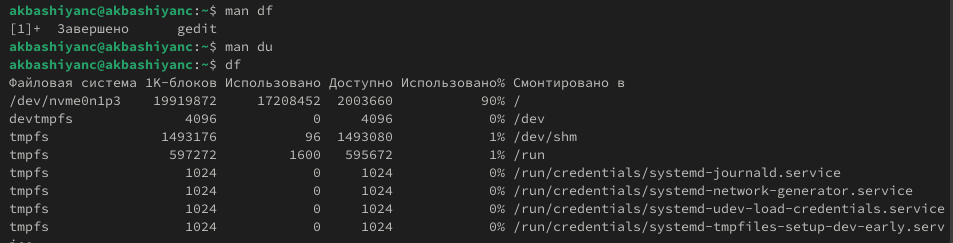{#fig:015 width=70%}

## du

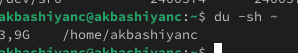{#fig:016 width=70%}

## find

Воспользовавшись справкой команды find, выведем имена всех директорий, имеющихся в нашем домашнем каталоге.

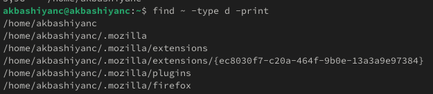{#fig:017 width=70%}

# Выводы

- В этой лабораторной работе мы изучили работу поиска файлов и фильтрации текстовых данных.
