---
## Front matter
lang: ru-RU
title: Лабораторная работа №9
subtitle: Операционные системы
author:
  - Башиянц А. К.
institute:
  - Российский университет дружбы народов, Москва, Россия

date: 

## i18n babel
babel-lang: russian
babel-otherlangs: english

## Formatting pdf
toc: false
toc-title: Содержание
slide_level: 2
aspectratio: 169
section-titles: true
theme: metropolis
header-includes:
 - \metroset{progressbar=frametitle,sectionpage=progressbar,numbering=fraction}
---

# Вводная часть

## Цели и задачи

Цель данной работы --- приобретение практических навыков по просмотру каталогов и файлов; манипуляций с ними.

* Просматривать каталоги;

* Просматривать и редактировать файлы;

* Взаимодействовать с файлами и каталогами.

# Выполнение лабораторной работы

## man mc

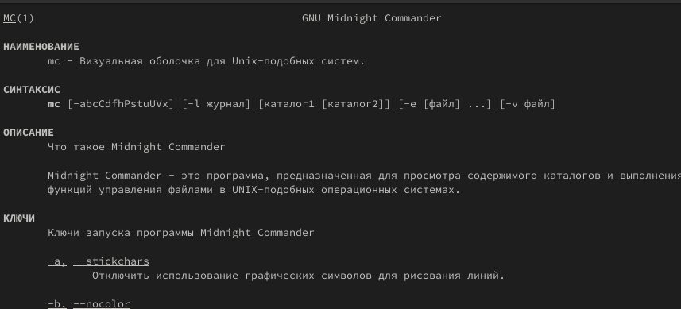{#fig:002 width=70%}

## mc

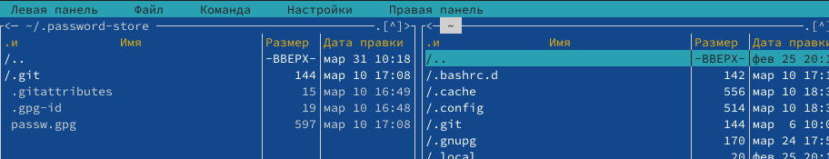{#fig:003 width=70%}

## Подменю Файл

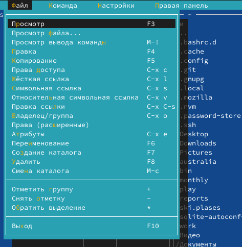{#fig:004 width=70%}

## Подменю Команда

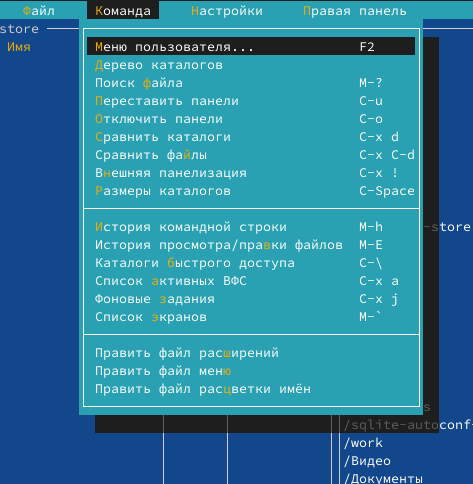{#fig:005 width=70%}

## Подменю Настройки

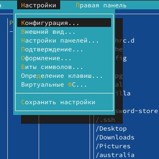{#fig:006 width=70%}

## text.txt

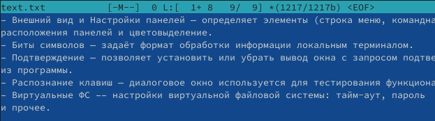{#fig:008 width=70%}

## Удаление строки

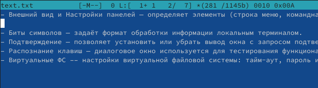{#fig:009 width=70%}

## Копия строки

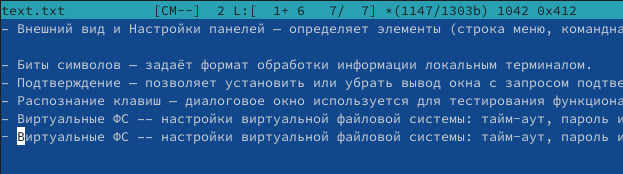{#fig:010 width=70%}

## Перенос строки

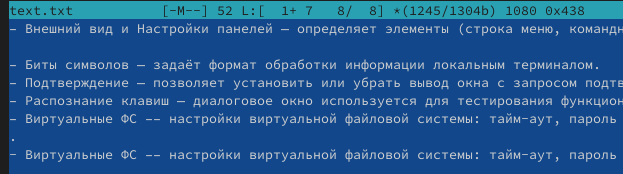{#fig:011 width=70%}

## Сохранение

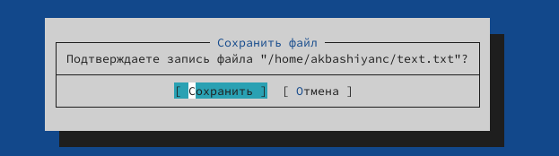{#fig:012 width=70%}

## Переход в начало и конец

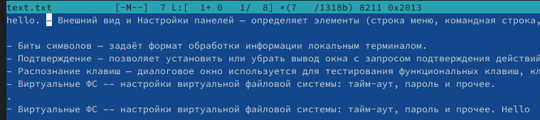{#fig:013 width=70%}

# Выводы

- В этой лабораторной работе мы изучили работу Midnight Commander.

