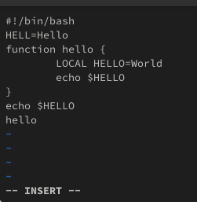
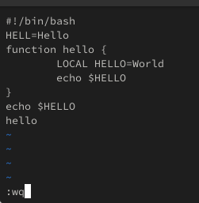
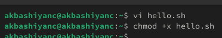
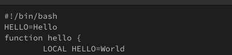
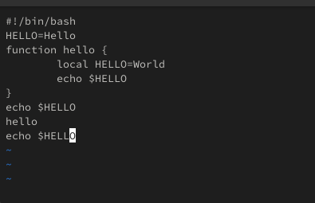
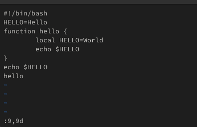
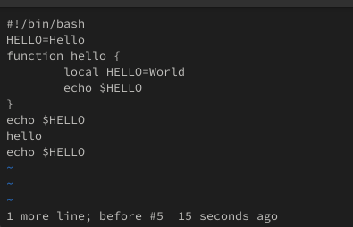
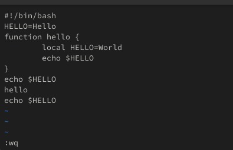

---
## Front matter
lang: ru-RU
title: Лабораторная работа №10
subtitle: Операционные системы
author:
  - Башиянц А. К.
institute:
  - Российский университет дружбы народов, Москва, Россия

date: 

## i18n babel
babel-lang: russian
babel-otherlangs: english

## Formatting pdf
toc: false
toc-title: Содержание
slide_level: 2
aspectratio: 169
section-titles: true
theme: metropolis
header-includes:
 - \metroset{progressbar=frametitle,sectionpage=progressbar,numbering=fraction}
---

# Вводная часть

## Цели и задачи

Цель данной работы --- приобретение практических навыков работы с редактором vi, установленным по умолчанию практически во всех дистрибутивах.

* Перемещаться по файлу;

* Вставлять текст;

* Удалять и отменять;

* Сохранение и изменение файла.

# Выполнение лабораторной работы

# Задание 1. Создание нового файла с использованием vi

## vi hello.sh

{#fig:001 width=70%}

## i

{#fig:002 width=70%}

## :qw

{#fig:004 width=70%}

## chmod

{#fig:005 width=70%}

# Задание 2. Редактирование существующего файла

## HELLO

{#fig:007 width=70%}

## local и echo

{#fig:009 width=70%}

## Удаление

{#fig:010 width=70%}

## Отмена

{#fig:011 width=70%}

## Сохранение

{#fig:012 width=70%}

# Выводы

- В этой лабораторной работе мы изучили работу работу редактора vi.
