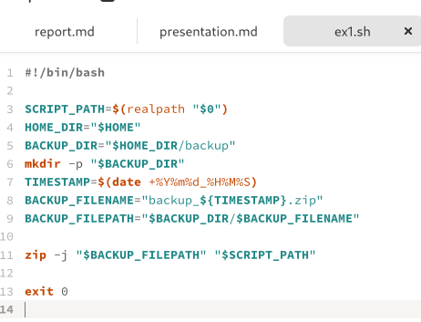
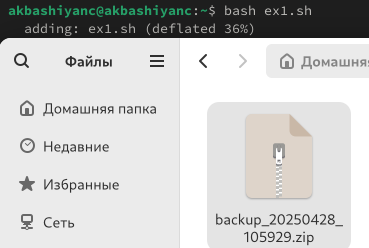
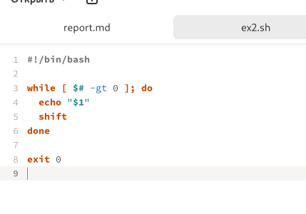
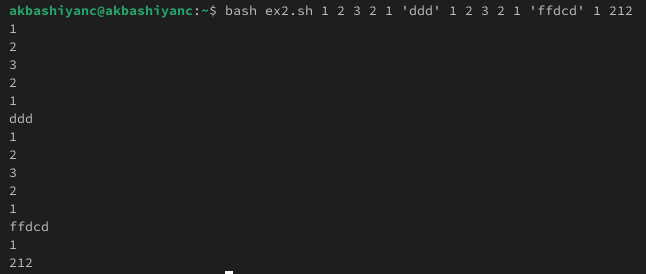
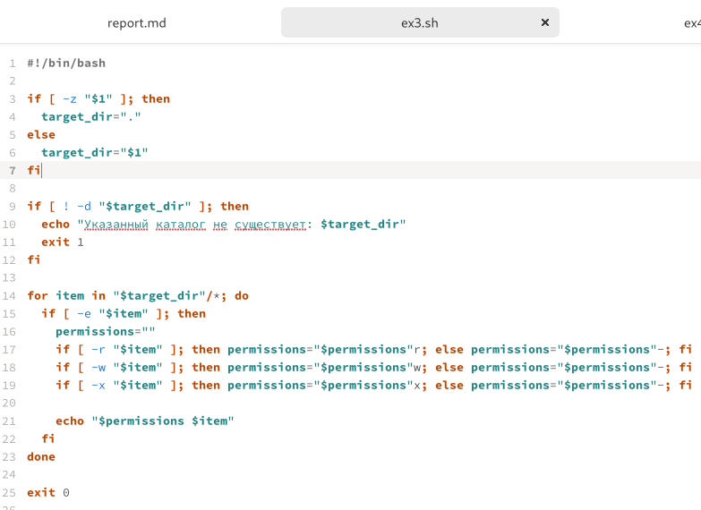
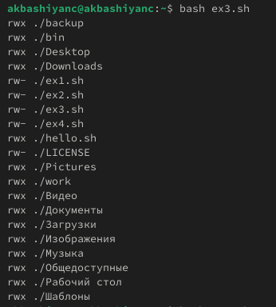
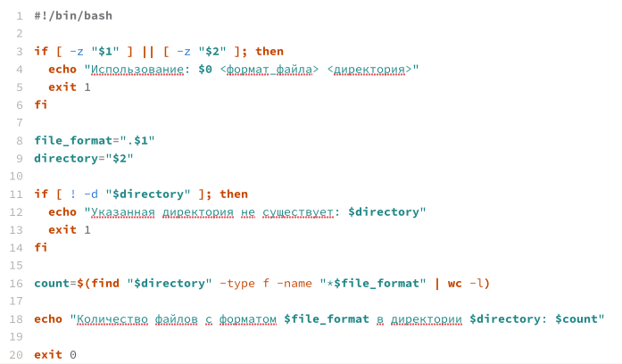

---
## Front matter
lang: ru-RU
title: Лабораторная работа №12
subtitle: Операционные системы
author:
  - Башиянц А. К.
institute:
  - Российский университет дружбы народов, Москва, Россия

date: 

## i18n babel
babel-lang: russian
babel-otherlangs: english

## Formatting pdf
toc: false
toc-title: Содержание
slide_level: 2
aspectratio: 169
section-titles: true
theme: metropolis
header-includes:
 - \metroset{progressbar=frametitle,sectionpage=progressbar,numbering=fraction}
---

# Вводная часть

## Цели и задачи

Цель данной работы --- изучить основы программирования в оболочке ОС UNIX/Linux. Научиться писать небольшие командные файлы.

* Использовать переменные;

* Использовать арифметические вычисления;

* Командные файлы и функции;

* Передача параметров в командные файлы и специальные переменные;

* Операторы циклов и условий.

# Выполнение лабораторной работы

## файлы sh

{#fig:001 width=70%}

## ex1.sh

{#fig:002 width=70%}

## bash ex1.sh

{#fig:003 width=70%}

## ex2.sh

{#fig:004 width=70%}

## bash ex2.sh

{#fig:005 width=70%}

## ex3.sh

{#fig:006 width=70%}

## bash ex3.sh

{#fig:007 width=70%}

## ex4.sh

{#fig:008 width=70%}

## bash ex4.sh

{#fig:009 width=70%}

# Выводы

- В этой лабораторной работе мы изучили работу работу bash-скриптов.
