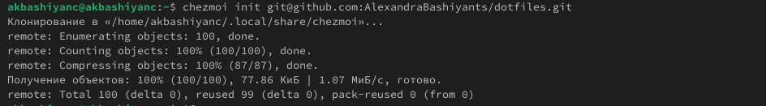

---
## Front matter
lang: ru-RU
title: Лабораторная работа №5
subtitle: Операционные системы
author:
  - Башиянц А. К.
institute:
  - Российский университет дружбы народов, Москва, Россия

date: 05 марта 2025

## i18n babel
babel-lang: russian
babel-otherlangs: english

## Formatting pdf
toc: false
toc-title: Содержание
slide_level: 2
aspectratio: 169
section-titles: true
theme: metropolis
header-includes:
 - \metroset{progressbar=frametitle,sectionpage=progressbar,numbering=fraction}
---

# Вводная часть

## Цели и задачи

Цель данной работы --- приобрести практические навыки настройки рабочей среды.

Необходимо научиться:

* Работать с менеджером паролей;

* Упралять файлами конфигурации;

* Работать с дополнительным ПО.

# Выполнение лабораторной работы

## Установка

{#fig:001 width=70%}

## Установка

{#fig:002 width=70%}

## Настройка

Проверим, что у нас есть ключ gpg и Иницилизируем хранилище.

{#fig:003 width=70%}

## Настройка

Синхронизируем с git. Создадим структуру git.

{#fig:004 width=70%}

## Настройка интерфейса с броузером

Установим плагин browserpass.

{#fig:005 width=70%}

## Сохранение пароля

Добавим новый пароль.

{#fig:009 width=70%}

## Сохранение пароля

Заменим существующий пароль.

{#fig:010 width=70%}

## Управление файлами конфигурации

Установим дополнительное программное обеспечение.

{#fig:a111 width=70%}

## Управление файлами конфигурации

Установим шрифты.

{#fig:012 width=70%}

## Установка бинарного файла

Установим бинарный файл.

{#fig:014 width=70%}

## Создание собственного репозитория с помощью утилит

Создадим свой репозиторий для конфигурационных файлов на основе шаблона.

{#fig:015 width=70%}

## Подключение репозитория к своей системе

Инициализируем chezmoi с вашим репозиторием dotfiles.

{#fig:016 width=70%}

    
# Выводы

- В этой лабораторной работе мы изучили настройку рабочей среды.
